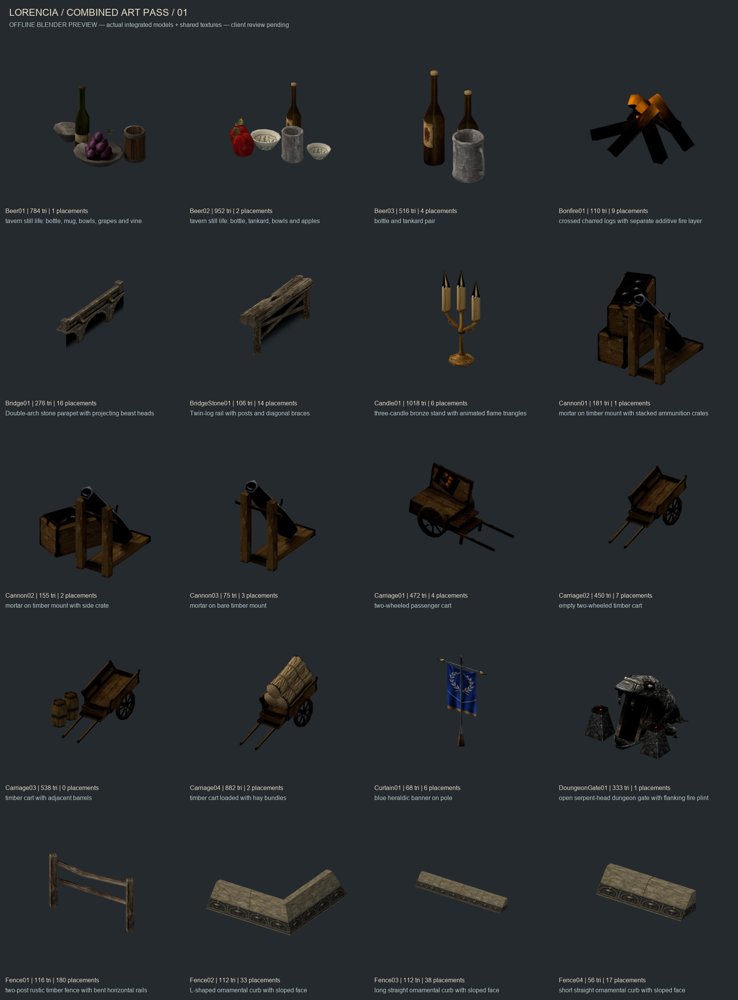
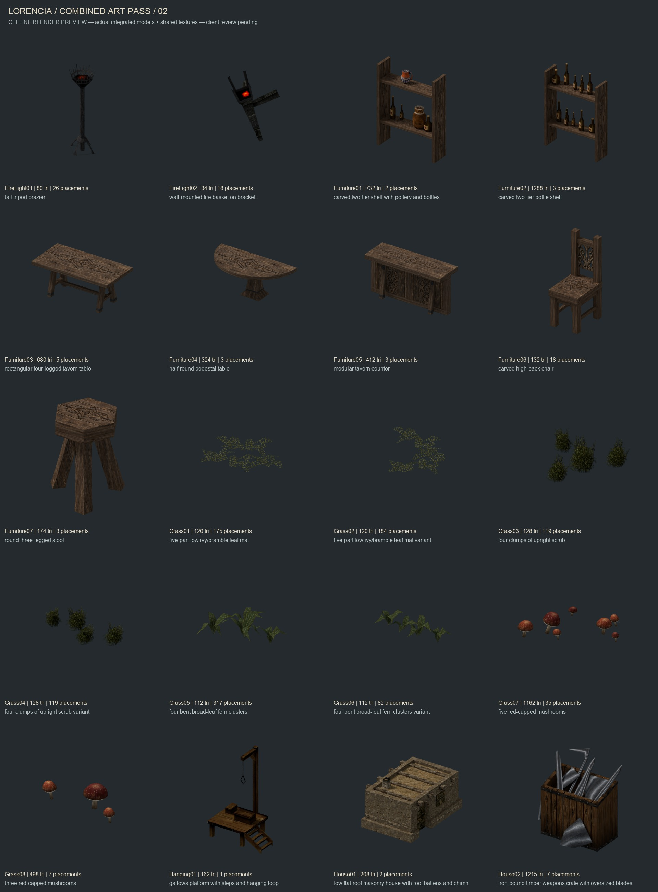
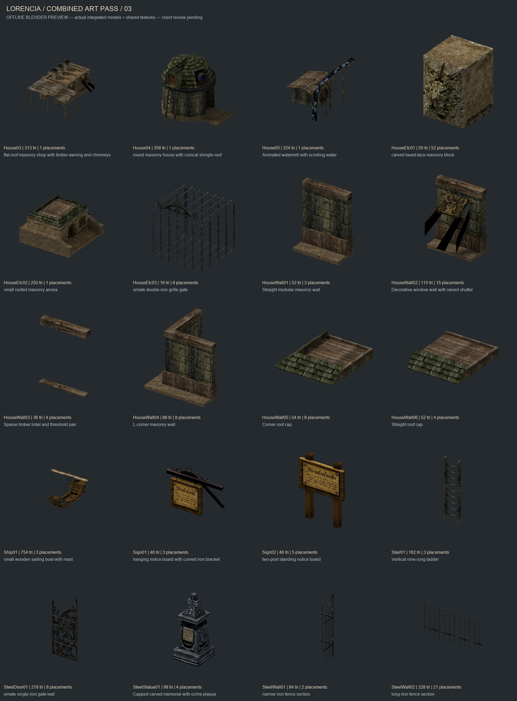
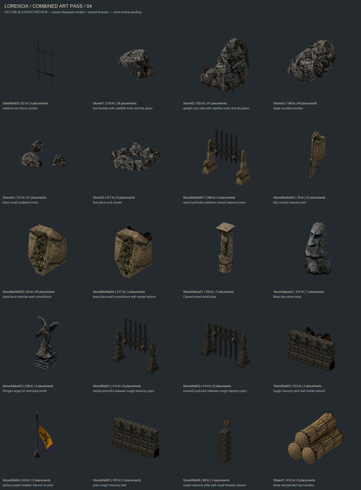
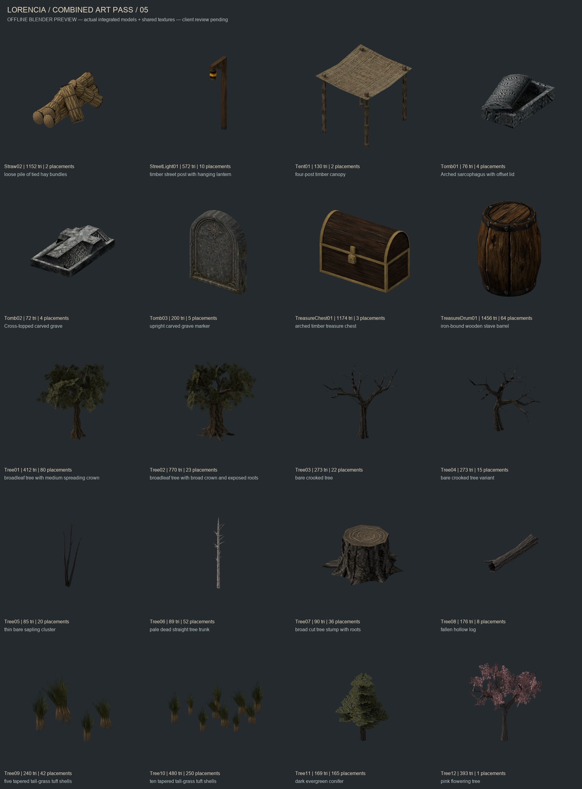
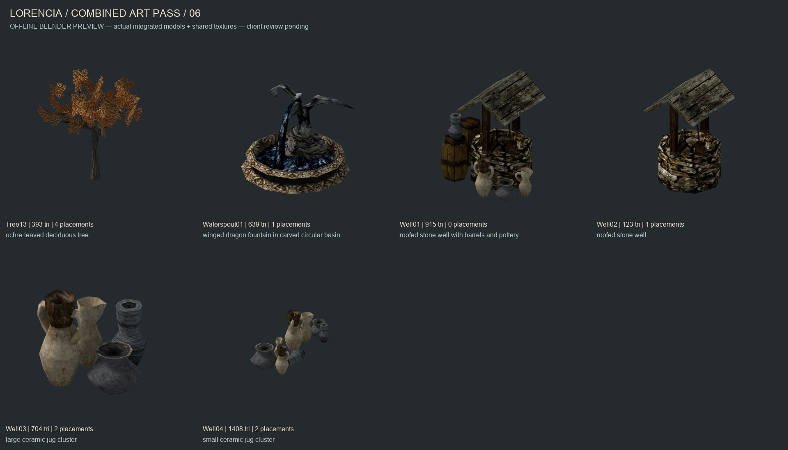

# Combined Lorencia offline review

All 106 in-scope static assets, rendered from the integration game files and their current shared textures. Each image has a SHA-256 provenance record. These are Blender diffuse previews, not client captures. Per-batch matching-camera comparisons, wireframes, animations and placement assemblies remain in each asset deliverable.

