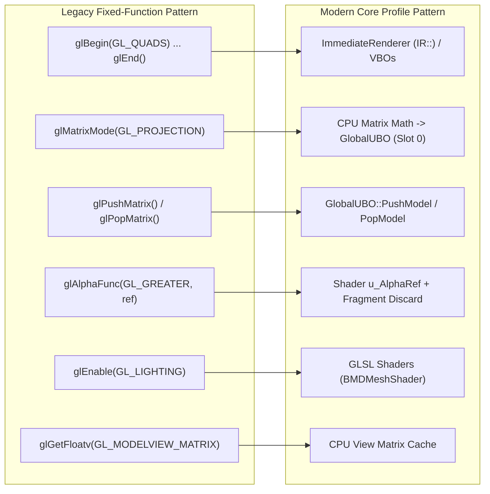
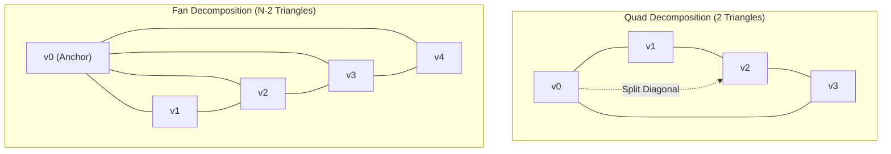
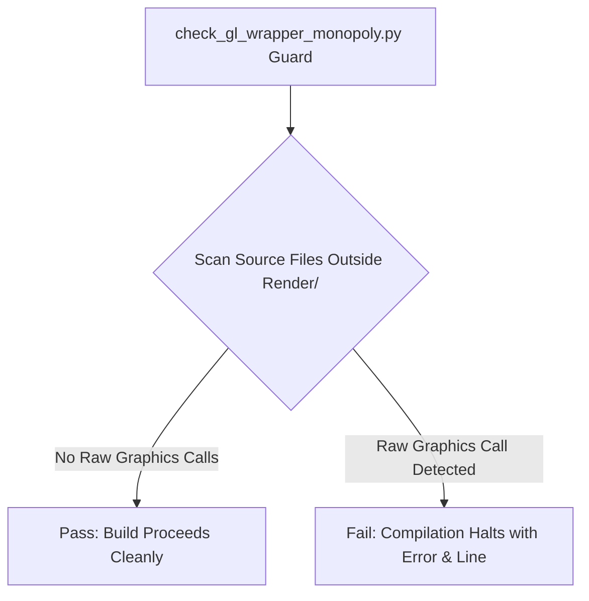

# Core Profile & Pipeline Migration Guide

This document details the modernization of the client rendering engine from fixed-function pipeline (FFP) legacy patterns to OpenGL 3.3 Core Profile compliance, Uniform Buffer Object matrix management, Immediate Renderer (`IR::`) primitive decomposition, and strict graphics wrapper isolation.

---

## 1. Core Profile Migration Strategy

The migration from legacy OpenGL compatibility profile to **OpenGL 3.3 Core Profile** (executed in `DXP-08`) enforced the complete elimination of fixed-function state machine features:

---

## 2. Matrix Stack & FFP Bridge Retirement

In legacy client code, camera, world, and projection matrices were maintained on driver-side fixed-function matrix stacks (`GL_MODELVIEW` and `GL_PROJECTION`). Modern shaders read view and projection matrices directly from `GlobalUBO` (Slot 0).

### CPU-Side Orthographic & Perspective Matrix Builders

- **`BeginBitmap()` (2D UI Ortho)**: Replaced `glOrtho()` with CPU-side orthographic projection matrix calculation uploaded directly to `GlobalUBO`.
- **`BeginOpengl()` (3D World View/Proj)**: Replaced `gluLookAt()` and `glFrustum()` with CPU-side view and perspective matrix math (`BuildPerspectiveProjection`).
- **`UpdateMousePosition()` (3D Ray Picking)**: Decoupled mouse-click ground picking from `glGetFloatv` driver readbacks by reading cached CPU camera matrices.

### Unified Projection Matrix Construction

> [!NOTE]
> All 3D cameras (world view, 3D UI item preview panels, photo viewers) construct perspective matrices via `BuildPerspectiveProjection()` (`Render/Core/RenderConfig.cpp`), ensuring consistent clip-space depth calculations across all rendering passes.

---

## 3. Immediate Renderer (`IR::`) & Primitive Decomposition

For UI controls, health bars, 2D sprites, particles, and dynamic lines, the engine provides the `ImmediateRenderer` (`IR::`) subsystem ([`Render/Core/ImmediateRenderer.cpp`](../../src/source/Render/Core/ImmediateRenderer.cpp)).

### Primitive Topology Decomposition

Hardware shader pipelines do not natively support legacy quad (`GL_QUADS`) or triangle fan (`GL_TRIANGLE_FAN`) primitives. `IR::` decomposes these primitives CPU-side into indexed triangle lists (`GL_TRIANGLES`) before issuing draw calls:

#### 1. Quads Decomposition (`GL_QUADS`)
For every 4 vertices submitted (`v0, v1, v2, v3`), `IR::End()` appends two triangles:
$$\text{Triangle 1}: [v_0, v_1, v_2], \quad \text{Triangle 2}: [v_0, v_2, v_3]$$

#### 2. Triangle Fan Decomposition (`GL_TRIANGLE_FAN`)
For $N$ vertices submitted ($v_0, v_1, \dots, v_{N-1}$), `IR::End()` generates $N-2$ triangles using the fan anchor $v_0$:
$$\text{Triangle } i: [v_0, v_{i}, v_{i+1}] \quad \text{for } 1 \le i \le N-2$$

### Streaming VBO Ring-Buffer Architecture

`ImmediateRenderer` streams dynamic vertex data through a pre-allocated dynamic vertex buffer using ring-buffer upload semantics (`DXP-26`):

1. **Sequential Append**: New draw calls append vertices sequentially into the buffer using `RHI::AppendBuffer`.
2. **Orphan-on-Wrap**: When the ring-buffer reaches capacity, it re-allocates or orphans the buffer, starting fresh at offset 0 without stalling the GPU pipeline.
3. **Persistent Program Binding**: Modern `IR::Begin()` binds the `PassthroughShader` through `BindState`'s dirty-check cache. If the same program is already bound from a prior draw, the `glUseProgram` call is skipped. `IR::End()` does not participate in bind caching.

---

## 4. Graphics Wrapper Monopoly & Enforcement

To prevent technical debt and ensure cross-platform driver compatibility, the client enforces a strict **State-Wrapper Monopoly** (`DXP-10`):

> **Invariant**: No raw graphics API calls (e.g., `glDrawArrays`, `glBindTexture`, `glUseProgram`) are permitted outside the `Render/` directory tree.

### Automated Build-Time Verification Guard

The build system executes [`CLIENT/Tools/check_gl_wrapper_monopoly.py`](../../Tools/check_gl_wrapper_monopoly.py) as an automatic custom target before compiling `MuClient`.

If developer code outside `Render/` attempts to invoke raw driver functions, the Python guard halts the build with a descriptive error pointing to the violating file and line number.

---

## 5. RHI Texture Management & Memory Operations

All texture operations are encapsulated behind the RHI layer:

- **Creation & Upload**: [`GlobalBitmap.cpp`](../../src/source/Render/Sprites/GlobalBitmap.cpp) creates textures via `RHI::CreateTexture`. The format is RGBA8 (hardcoded — no named RHI format constant exists; `DXGI_FORMAT_R8G8B8A8_UNORM`-style named constants are D3D11-side only; the GL backend hardwires `GL_RGBA8`). No automatic mipmap generation occurs — textures are single-level unless explicitly updated.
- **Dynamic Streaming**: UI fonts, dynamic minimaps, and reconnect dialogs update sub-regions of textures using `RHI::UpdateTexture`.
- **Pixel Readback**: Two separate readback functions exist behind the RHI:
  - `RHI::ReadColorFramebuffer` — used by screenshot export and the reconnect-dialog background blur. Returns top-down row order regardless of backend.
  - `RHI::ReadDepthPixel` — used by `CameraProjection::TestDepthBuffer` for depth-buffer sampling. Note: `RHI::ReadPixels` does **not** exist as a function.
