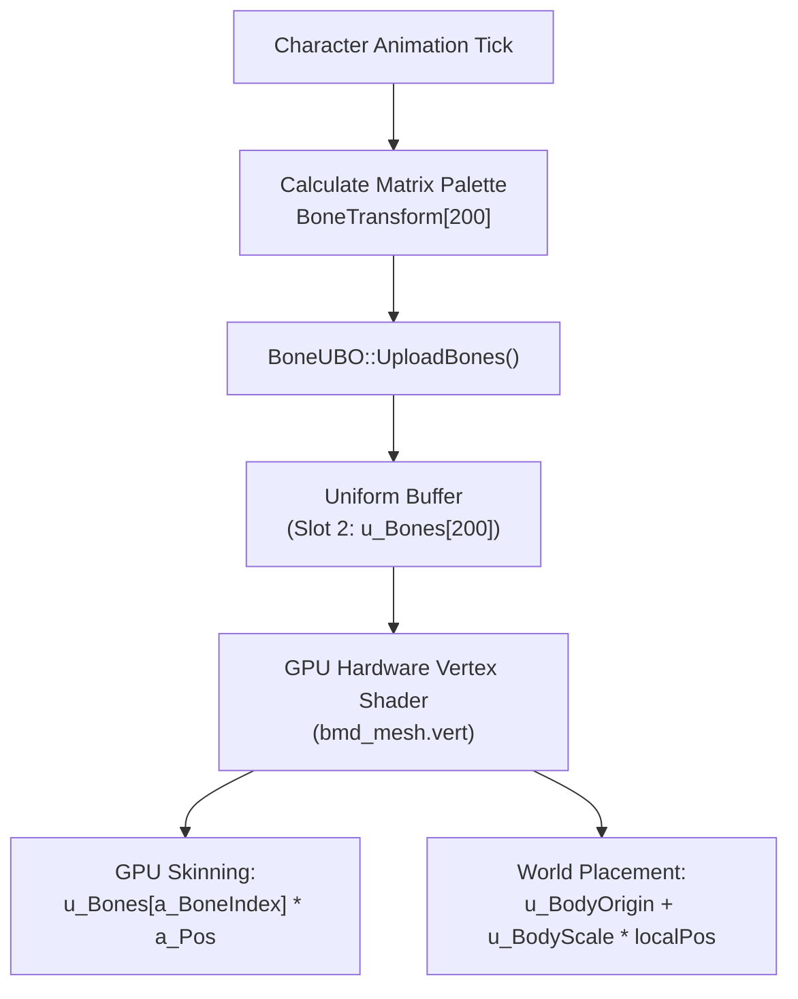
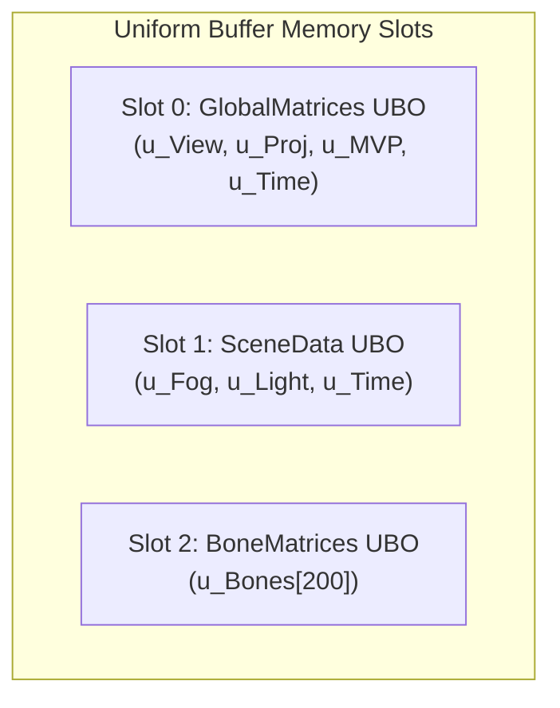
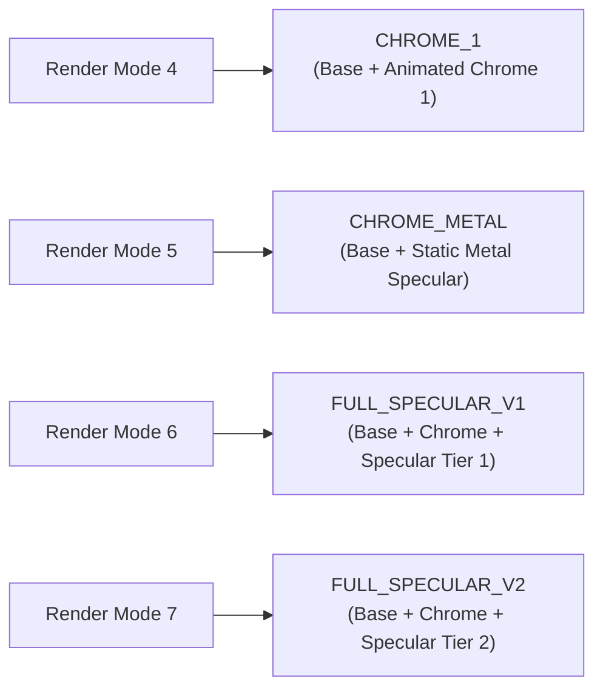
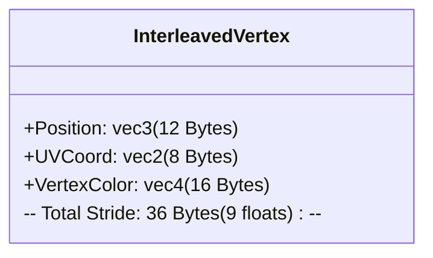

# GPU Skeletal Skinning Architecture

This document provides a comprehensive technical specification of the **GPU Skeletal Skinning Engine** implemented in the MU Online client (`Render/Models/ZzzBMD.cpp`, `Render/Core/BoneUBO.h`, and `Render/Shaders/BMDMeshShader.cpp`).

---

## 1. Overview & High-Level Pipeline

Historically, skeletal transformation in MU Online was executed entirely on the CPU: every frame, every visible character, armor mesh, weapon, and monster calculated 3×4 matrix multiplications per vertex into CPU scratch arrays (`VertexTransform`), streaming transformed vertices to the GPU via legacy vertex arrays or immediate mode.

The **GPU Skeletal Skinning Engine** (introduced in `DXP-20`) offloads vertex transformation entirely to the GPU hardware:



---

## 2. Uniform Buffer Object (UBO) Architecture

The client allocates three primary Uniform Buffer Object slots reserved for rendering models and world geometry:



### Bone UBO Layout (`Slot 2`)

The bone UBO stores an array of 200 4x4 bone matrices in `std140` layout:

```glsl
layout(std140, binding = 1) uniform BoneMatrices {  // shader-side comment; runtime binding is slot 2
    mat4 u_Bones[200];
};
```

> [!NOTE]
> **Pre-existing binding inconsistency**: The GLSL source comment says `binding = 1`, but at runtime `BoneUBO::Create()` binds to **slot 2**. This mismatch exists in the codebase itself (not introduced by documentation). The runtime binding (slot 2) is authoritative — it is what the GPU actually uses.

#### The `MAX_BONES = 200` Invariant

> [!IMPORTANT]
> **Critical Invariant**: Every `UploadBones()` invocation **MUST** upload all `MAX_BONES` (200) matrices regardless of the individual mesh's `bmd->NumBones` count.

- **Root Cause**: Equipped armor items (`bmdArmor` — helm, chest, pants, gloves, boots) contain small internal `NumBones` metadata (e.g. 12 to 15 bones), but armor mesh vertices reference character skeleton bone indices spanning the full `0..199` range (e.g., knee = bone 35, foot = bone 42).
- **The "Hollowman" Defect**: If `UploadBones()` only uploads `bmdArmor->NumBones` (15 matrices), bone indices > 15 read uninitialized garbage or zero matrices in the vertex shader, collapsing torso, arm, and leg vertices to the origin (rendering the character as a hollow/invisible float).
- **Allocation Rule**: All `BoneTransform` buffers allocated in client code (e.g., `OBJECT::BoneTransform`) must allocate space for at least 200 `vec34_t` elements (`new vec34_t[MAX_BONES]`).

---

## 3. Skeleton Sharing & Active Palette Pointer

In the engine's animation data model, equipped armor items do not run independent skeletal animation. Instead, armor meshes share the base character's skeletal transform palette.

### `g_pActiveBoneTransform` Pointer Mechanics

```cpp
// In ZzzBMD.cpp / ZzzCharacter.cpp:
vec34_t* activeBones = g_pActiveBoneTransform ? g_pActiveBoneTransform : pObject->BoneTransform;
BoneUBO::Instance().UploadBones(activeBones, MAX_BONES, g_BoneTransformVersion);
```

1. Before rendering an equipped armor mesh (`bmdArmor`), the character pipeline sets `g_pActiveBoneTransform = characterObject->BoneTransform`.
2. When `bmdArmor->RenderMesh()` executes, it detects `g_pActiveBoneTransform != nullptr` and uploads the character's active bone matrix palette to `u_Bones`.
3. Equipped weapons, wings, and mounts (Fenrir, Dark Horse) similarly bind into the active skeleton palette pointer.

### Version-Stamped Deduplication

To avoid redundant GPU buffer uploads (`glBufferSubData`) when consecutive meshes share the identical skeleton:

```cpp
void SetActiveBoneTransform(vec34_t* pTransform) {
    g_pActiveBoneTransform = pTransform;
    g_BoneTransformVersion++; // Unconditionally bumps global version stamp every call
}
```

> [!NOTE]
> `SetActiveBoneTransform()` **does not** guard on pointer comparison. It unconditionally sets the pointer and bumps the version stamp every call. The deduplication logic lives entirely in `BoneUBO::UploadBones(ptr, count, version)`, which skips a GPU buffer upload **only if both** the pointer `ptr` AND the `version` stamp match the values from the previous upload.

> [!CAUTION]
> **Pointer-Only Caching Hazard**: Pointer-only caching in `UploadBones` would be unsafe because sub-item rendering (e.g., wings) uses **stack-local** matrix arrays allocated at the same stack depth across calls. Two distinct calls could receive the *same memory address* with *different matrix content*. The `version` stamp prevents stale matrix uploads by ensuring identity requires both address AND generation match.

---

## 4. Vertex Shader Transformation Mathematics (`bmd_mesh.vert`)

The GPU vertex shader converts rest-pose model vertices `a_Pos` into final screen-space clip coordinates.

### Shader Inputs & Uniforms

- `a_Pos`: Local rest-pose vertex position (`vec3`).
- `a_Normal`: Local rest-pose vertex normal (`vec3`).
- `a_BoneIndex`: Vertex bone attachment index (`int` or `float`).
- `u_BodyOrigin`: Character/Object world position (`vec3`).
- `u_BodyScale`: Object scale factor (`float`).
- `u_MVPDraw`: Combined View-Projection matrix for the current pass (`mat4`).

### World Placement Equations

$$\text{localPos} = \text{u\_Bones}[\text{a\_BoneIndex}] \cdot \text{vec4}(\text{a\_Pos}, 1.0)$$

$$\text{worldPos} = \text{u\_BodyOrigin} + \text{u\_BodyScale} \cdot \text{localPos.xyz}$$

$$\text{gl\_Position} = \text{u\_MVPDraw} \cdot \text{vec4}(\text{worldPos}, 1.0)$$

### Normal Skinning & Chrome Generation

For lit or reflective meshes:

$$\text{skinnedNormal} = \text{normalize}(\text{mat3}(\text{u\_Bones}[\text{a\_BoneIndex}]) \cdot \text{a\_Normal})$$

For chrome reflection (`u_RenderMode == 3`), animated chrome UV coordinates are calculated on the GPU from the skinned normal. RenderMode 3 covers both plain `RENDER_CHROME` and the CHROME2/3/5/6/7/METAL variants — the variant is selected via the `u_ChromeVariant` uniform (introduced in DXP-20-inc5). The base formula (plain chrome fallback):

$$\text{v\_ChromeUV.x} = \text{skinnedNormal.z} \cdot 0.5 + \text{u\_ChromeWave}$$

$$\text{v\_ChromeUV.y} = \text{skinnedNormal.y} \cdot 0.5 + \text{u\_ChromeWave} \cdot 2.0$$

CHROME2/3/5/6/7/METAL variants use separate per-variant UV formulas dispatched via `u_ChromeVariant`; CHROME4/OIL take a CPU dynamic-VBO path and are never GPU-eligible.

### Matrix Translate Flag (`m_LastTranslate`)

World map decorations and static environment objects execute `Transform()` with `Translate = false`. For these objects, world translation is pre-encoded inside their bone matrices.

When `m_LastTranslate == false`, the shader dispatcher passes `u_BodyOrigin = vec3(0.0)` and `u_BodyScale = 1.0f` to prevent applying world translation twice.

---

## 5. Item Specular & Equipment Glow Engine (`CItemSpecularShader`)

High-level equipment (+7 through +15 armor and weapons) displays dynamic animated shine, specular highlights, and characteristic color tints.



### Two-Tier Tint Modulation

1. **`u_BodyLight`**: Dynamic scene lighting (`Light * bodyLightScale`) modulating base textures and animated light sweeps.
2. **`u_SpecularTint`**: Static item characteristic color (`PartObjectColor`) modulating metallic layers so armor identity is preserved (e.g., Dragon armor retains blue metallic shine).

---

## 6. Dynamic VBO Interleaving Architecture

For dynamic meshes that update per frame (e.g., custom particle meshes or UI preview quads), the renderer uses interleaved vertex buffer layouts:



### Performance Advantages
- **Single GPU Upload**: Interleaving position, UV, and color into one contiguous memory block reduces GPU buffer sub-data calls from 3 to 1 per mesh pass.
- **Pre-Allocated Staging Pools**: `BMD` instances hold pre-allocated `m_Staging` vectors, completely eliminating per-frame heap allocations during render passes.
