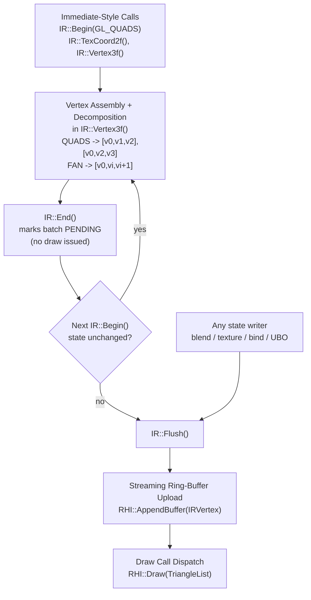

# ImmediateRenderer (IR::) Architecture & Task Documentation

This document provides a technical specification of the **ImmediateRenderer (`IR::`) Subsystem** (`Render/Core/ImmediateRenderer.h` and `Render/Core/ImmediateRenderer.cpp`), detailing its primitive decomposition math, dynamic vertex ring-buffer architecture, RHI integration, and complete task milestone history.

---

## 1. Overview & Subsystem Purpose

Historically, 2D UI elements (windows, buttons, icons), health bars, dynamic particle effects, joint blurs, text rendering, and cloth physics meshes relied on fixed-function immediate mode calls (`glBegin`, `glEnd`, `glVertex3f`, `glTexCoord2f`, `glColor4f`).

In GLSL 3.3 Core Profile, immediate mode functions and primitive topologies like `GL_QUADS` and `GL_TRIANGLE_FAN` are completely deprecated and removed.

The **ImmediateRenderer (`IR::`)** acts as a high-performance CPU-to-GPU dynamic batcher that emulates an immediate-style API while building **non-indexed** triangle-list streaming buffers compatible with hardware shader pipelines.



> **Note (GLP-19, 2026-08-12).** `IR::End()` no longer draws. Earlier revisions of this document
> described `End()` as dispatching the draw call and decomposing topology; both moved. Decomposition
> now happens per-vertex in `IR::Vertex3f()`, and submission happens in `IR::Flush()`.

---

## 2. API Surface & Call Lifecycle

The `IR::` pipeline exposes a stateful submission API mimicking legacy OpenGL semantics, ensuring minimal code refactoring when porting legacy call sites:

```cpp
IR::Begin(GL_QUADS);
    IR::TexCoord2f(u0, v0);
    IR::Color4f(r, g, b, a);
    IR::Vertex3f(x0, y0, z0);

    IR::TexCoord2f(u1, v1);
    IR::Color4f(r, g, b, a);
    IR::Vertex3f(x1, y1, z0);

    IR::TexCoord2f(u2, v2);
    IR::Color4f(r, g, b, a);
    IR::Vertex3f(x1, y2, z0);

    IR::TexCoord2f(u3, v3);
    IR::Color4f(r, g, b, a);
    IR::Vertex3f(x0, y2, z0);
IR::End();
```

### State Accumulation Sequence
1. **`IR::Begin(primitiveType)`**: Binds `PassthroughShader`, resets the quad/fan scratch counters, sets the current primitive mode, and decides whether the *previous* batch can be extended — see [§4.4](#44-cross-beginend-batching-glp-19). If it cannot, flushes it and clears the vertex buffer.
2. **Attribute Mutators**: `IR::TexCoord2f()`, `IR::Color4f()`, `IR::Color4ub()` update active transient attributes.
3. **`IR::Vertex3f()` / `IR::Vertex2f()`**: Combines `(Position, Current_UV, Current_Color)` and performs topology decomposition inline — a completed quad emits its 6 triangle-list vertices here, a fan emits `[first, prev, current]` from the third vertex on.
4. **`IR::End()`**: Marks the accumulated run **pending** and snapshots the render state it was built under. **It issues no GL call.** The draw happens later, in `IR::Flush()`.
5. **`IR::Flush(FlushSource)`**: Uploads the whole accumulated run in one `RHI::AppendBuffer` and issues one non-indexed `RHI::Draw`. Called by the next incompatible `Begin()`, by any state writer that would invalidate the batch, and unconditionally at frame end in `PlatformSwapBuffers()`.

> A batch is never submitted under state it was not built with: every writer that can change the
> result — blend mode, engine texture, program/VAO/texture binds, matrix UBO uploads, the
> `PassthroughShader` uniform setters — calls `IR::Flush()` **before** mutating, from inside its own
> dirty check. That ordering has a consequence worth knowing before debugging this system; see
> [gotchas §4.2](gotchas-and-patterns.md).

---

## 3. Primitive Topology Decomposition

Hardware shader pipelines execute indexed triangle lists (`GL_TRIANGLES`). `IR::End()` decomposes non-standard topologies CPU-side before index stream generation:

### 3.1 Quad Decomposition (`GL_QUADS`)
Every block of 4 vertices $(v_0, v_1, v_2, v_3)$ is decomposed into two triangles:
$$\text{Triangle 1}: [v_0, v_1, v_2], \quad \text{Triangle 2}: [v_0, v_2, v_3]$$

```
  v0 +----------+ v1
     | \        |
     |   \ T1   |   T1: [v0, v1, v2]
     | T2  \    |   T2: [v0, v2, v3]
  v3 +----------+ v2
```

### 3.2 Triangle Fan Decomposition (`GL_TRIANGLE_FAN`)
For $N$ vertices submitted ($v_0, v_1, \dots, v_{N-1}$), $N-2$ triangles are generated anchored at root vertex $v_0$:
$$\text{Triangle } i: [v_0, v_{i}, v_{i+1}] \quad \text{for } 1 \le i \le N-2$$

---

## 4. Streaming Vertex Ring-Buffer & Performance Optimizations

Dynamic 2D rendering submits thousands of temporary vertices per frame. To eliminate heap allocations and GPU stalls, `IR::` uses a streaming ring-buffer architecture (`DXP-26`):

### 4.1 Memory Interleaving (`IRVertex`)
Vertices are stored in a contiguous 36-byte interleaved structure optimized for cache locality and vertex attribute fetch performance:

| Offset | Attribute | Type | Size |
|---|---|---|---|
| `0` | Position (`a_Pos`) | `float[3]` | 12 bytes |
| `12` | TexCoord (`a_UV`) | `float[2]` | 8 bytes |
| `20` | Color (`a_Color`) | `float[4]` (r, g, b, a) | 16 bytes |
| | **Total stride** | | **36 bytes** |

### 4.2 Orphan-on-Wrap Semantics and Ring Growth (`GLP-25`)
- Vertices append sequentially into a pre-allocated dynamic VBO.
- When remaining buffer capacity is insufficient for a draw call, `IR::` issues an **orphan-on-wrap** call (`glBufferData(..., NULL, GL_STREAM_DRAW)`), returning a fresh memory region from the driver without stalling currently executing GPU pipelines.
- **`GLP-25`**: `RHI::AppendBuffer` originally grew the buffer only when a *single* append exceeded the whole buffer, so a ring merely too small for a frame's total volume wrapped repeatedly forever rather than growing out of it — an effect-dense frame wrapped ~23 times. A per-buffer wrap counter now doubles capacity after repeated same-frame wraps, up to a cap, and IR reserves 65,536 vertices (~2.25 MB, ~10,900 quads per wrap) up front. Measured effect: orphans 21 → 1 at the same test spot.

### 4.3 Program Bind Caching
`IR::Begin()` calls `PassthroughShader::Bind()`, which routes through `BindState::BindProgram()` — a dirty-check cache that skips `glUseProgram` if the same program is already active. If consecutive draw calls share the same shader program (e.g. batched UI buttons or health bars), the bind is a no-op.

> **Corrected (DXP-26 step 3).** An earlier revision of this document stated that `IR::End()` calls
> `PassthroughShader::Unbind()` and unconditionally issues `BindProgram(0)` after every draw. That
> reflexive unbind was removed — `End()` leaves the program bound so consecutive IR draws hit the
> bind cache, which is the overwhelmingly common case. The one fixed-function fallback that needs a
> real unbind (`RenderTerrainFrustrum`'s grass-tile path) calls `UnbindAllShaders()` once per pass.

### 4.4 Cross-Begin/End Batching (`GLP-19`)
`End()` defers instead of drawing, and the next `Begin()` decides whether the accumulated run can be extended. Compatibility is a field-wise comparison of an `IRBatchKey` — blend type, alpha test/ref, depth test/mask, cull, texture enable, fog, engine texture id, plus `PassthroughShader`'s `useTexture`/`useFog`/`texCombineAdd`. The key is **never hashed**: a collision would draw a quad with the wrong texture or blend mode, scene-dependent and near-impossible to reproduce.

**What this does and does not buy.** UI, text and joint geometry batch very well — a measured Release capture shows the `Joints` pass emitting ~26,700 quads in **14 draws**. Particles do not batch **at all**: the same frame shows `Particles` at 2,918 quads in **2,918 draws**, because `RenderParticles()` changes blend mode roughly once per particle and each change correctly flushes first. Collapsing that requires grouping particles by blend state before drawing them, which is `GLP-20` and is not implemented. Do not expect this mechanism to help any call site that changes render state per primitive.

---

## 5. Task & Milestone History Catalog (`IR::`)

The following milestone tasks directly involved or impacted the `ImmediateRenderer` subsystem:

| Milestone | Subsystem | Description & Task Scope |
|---|---|---|
| **`DXP-03`** | Physics | **Cloth & Cape ImmediateRenderer Port**: Replaced legacy `glBegin(GL_QUADS)` in `CPhysicsCloth::RenderFace` with `IR::` primitive calls, restoring cape rendering in Core Profile. |
| **`DXP-09`** | Core Render | **IR Primitive Topology Decomposition**: Implemented Quad and Triangle Fan index decomposition logic inside `IR::End()`. |
| **`DXP-11`** | RHI Core | **RHI Interface Extraction**: Refactored `IR::` to execute buffer uploads and state bindings through abstract `RHI` methods (`RHI::AppendBuffer`, `RHI::DrawIndexed`). |
| **`DXP-15`** | RHI 2D | **RHI Immediate Renderer & 2D Pipeline**: Integrated 2D sprites, UI boxes, text rendering, and health bars into abstract RHI Pipeline State Objects (PSOs). |
| **`DXP-22`** | Core Render | **Bind State Monopoly & Cache Invalidation**: Added VAO and VBO bind cache clearing on resource deletion to prevent state corruption when `IR::` binds dynamic buffers. |
| **`DXP-26`** | Core Render | **IR Ring-Buffer & Program Bind Cache Fix**: Introduced dynamic streaming ring-buffer with orphan-on-wrap upload semantics and persistent shader program binding cache. Its recorded "Stage 2 — cross-quad batching" became `GLP-19` + `GLP-20`. |
| **`GLP-19`** | Core Render | **Cross-Begin/End Batching**: `End()` defers, `Begin()` merges into the pending batch when render state is unchanged, and every state writer flushes first from inside its own dirty check. Real win for UI/text/joints; measured to deliver nothing for particles. See [§4.4](#44-cross-beginend-batching-glp-19). |
| **`GLP-25`** | RHI / Core Render | **Streaming Ring Growth Policy**: grow the ring on repeated wraps, not only on oversized appends; raise IR's initial reservation to 65,536 vertices. See [§4.2](#42-orphan-on-wrap-semantics-and-ring-growth-glp-25). |
| **`GLP-29`** | Core Render | **Vertex-Generation CPU**: replaced IR's 4-element quad scratch `std::vector` with a fixed array (~11,900 vector ops/frame removed at 2,975 particles), and collapsed `RenderSprite`'s Z-only rotation to 2D. −35% Debug frame CPU, no measurable Release win. |
| **`GLP-20`** | Core Render | **IR State-Change Batcher** *(not implemented)*: group particles by blend state so `GLP-19`'s merge can apply to them. The remaining half of DXP-26 Stage 2. |

---

## 6. Primary Call Sites & Subsystems Map

The `ImmediateRenderer` handles all dynamic 2D and un-instanced 3D dynamic geometry across the client codebase:

| Category | Primary Source Files | Usage |
|---|---|---|
| **2D UI & Textures** | `Render/Textures/ZzzOpenglUtil.cpp`<br>`Sprites/Sprite.cpp` | `RenderBitmap`, `RenderColor`, `RenderQuad`, button states, window frames. |
| **Physics & Cloth** | `Engine/Physics/PhysicsManager.cpp` | `CPhysicsCloth::RenderFace` (character capes, flags, banners). |
| **Particles & Effects** | `Effects/ZzzEffectJoint.cpp`<br>`Effects/ZzzEffectBlurSpark.cpp` | Weapon trail blurs, magic skill sparks, aura rings. |
| **Shadows & Terrain** | `Models/ShadowVolume.cpp`<br>`Terrain/CSWaterTerrain.cpp` | Planar shadow polygons and water surface quad meshes. |
