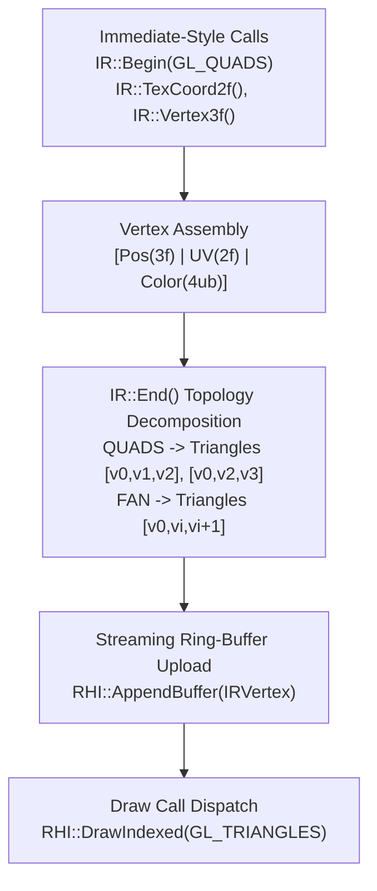

# ImmediateRenderer (IR::) Architecture & Task Documentation

This document provides a technical specification of the **ImmediateRenderer (`IR::`) Subsystem** (`Render/Core/ImmediateRenderer.h` and `Render/Core/ImmediateRenderer.cpp`), detailing its primitive decomposition math, dynamic vertex ring-buffer architecture, RHI integration, and complete task milestone history.

---

## 1. Overview & Subsystem Purpose

Historically, 2D UI elements (windows, buttons, icons), health bars, dynamic particle effects, joint blurs, text rendering, and cloth physics meshes relied on fixed-function immediate mode calls (`glBegin`, `glEnd`, `glVertex3f`, `glTexCoord2f`, `glColor4f`).

In GLSL 3.3 Core Profile, immediate mode functions and primitive topologies like `GL_QUADS` and `GL_TRIANGLE_FAN` are completely deprecated and removed.

The **ImmediateRenderer (`IR::`)** acts as a high-performance CPU-to-GPU dynamic batcher that emulates an immediate-style API while building indexed triangle streaming buffers compatible with hardware shader pipelines.



---

## 2. API Surface & Call Lifecycle

The `IR::` pipeline exposes a stateful submission API mimicking legacy OpenGL semantics, ensuring minimal code refactoring when porting legacy call sites:

```cpp
IR::Begin(GL_QUADS);
    IR::TexCoord2f(u0, v0);
    IR::Color4f(r, g, b, a);
    IR::Vertex3f(x0, y0, z0);

    IR::TexCoord2f(u1, v1);
    IR::Color4f(r, g, b, a);
    IR::Vertex3f(x1, y1, z0);

    IR::TexCoord2f(u2, v2);
    IR::Color4f(r, g, b, a);
    IR::Vertex3f(x1, y2, z0);

    IR::TexCoord2f(u3, v3);
    IR::Color4f(r, g, b, a);
    IR::Vertex3f(x0, y2, z0);
IR::End();
```

### State Accumulation Sequence
1. **`IR::Begin(primitiveType)`**: Resets internal vertex scratch counters and sets current primitive mode (`GL_TRIANGLES`, `GL_QUADS`, `GL_TRIANGLE_FAN`, `GL_LINES`).
2. **Attribute Mutators**: `IR::TexCoord2f()`, `IR::Color4f()`, `IR::Color4ub()` update active transient attributes.
3. **`IR::Vertex3f()` / `IR::Vertex2f()`**: Pushes a new vertex combining `(Position, Current_UV, Current_Color)` into the scratch buffer array.
4. **`IR::End()`**: Triggers primitive decomposition, streams vertex/index data to the ring-buffer, and dispatches the indexed draw call.

---

## 3. Primitive Topology Decomposition

Hardware shader pipelines execute indexed triangle lists (`GL_TRIANGLES`). `IR::End()` decomposes non-standard topologies CPU-side before index stream generation:

### 3.1 Quad Decomposition (`GL_QUADS`)
Every block of 4 vertices $(v_0, v_1, v_2, v_3)$ is decomposed into two triangles:
$$\text{Triangle 1}: [v_0, v_1, v_2], \quad \text{Triangle 2}: [v_0, v_2, v_3]$$

```
  v0 +----------+ v1
     | \        |
     |   \ T1   |   T1: [v0, v1, v2]
     | T2  \    |   T2: [v0, v2, v3]
  v3 +----------+ v2
```

### 3.2 Triangle Fan Decomposition (`GL_TRIANGLE_FAN`)
For $N$ vertices submitted ($v_0, v_1, \dots, v_{N-1}$), $N-2$ triangles are generated anchored at root vertex $v_0$:
$$\text{Triangle } i: [v_0, v_{i}, v_{i+1}] \quad \text{for } 1 \le i \le N-2$$

---

## 4. Streaming Vertex Ring-Buffer & Performance Optimizations

Dynamic 2D rendering submits thousands of temporary vertices per frame. To eliminate heap allocations and GPU stalls, `IR::` uses a streaming ring-buffer architecture (`DXP-26`):

### 4.1 Memory Interleaving (`IRVertex`)
Vertices are stored in a contiguous 36-byte interleaved structure optimized for cache locality and vertex attribute fetch performance:

| Offset | Attribute | Type | Size |
|---|---|---|---|
| `0` | Position (`a_Pos`) | `float[3]` | 12 bytes |
| `12` | TexCoord (`a_UV`) | `float[2]` | 8 bytes |
| `20` | Color (`a_Color`) | `float[4]` (r, g, b, a) | 16 bytes |
| | **Total stride** | | **36 bytes** |

### 4.2 Orphan-on-Wrap Semantics
- Vertices append sequentially into a pre-allocated dynamic VBO.
- When remaining buffer capacity is insufficient for a draw call, `IR::` issues an **orphan-on-wrap** call (`glBufferData(..., NULL, GL_STREAM_DRAW)`), returning a fresh memory region from the driver without stalling currently executing GPU pipelines.

### 4.3 Program Bind Caching
`IR::Begin()` calls `PassthroughShader::Bind()`, which routes through `BindState::BindProgram()` — a dirty-check cache that skips `glUseProgram` if the same program is already active. If consecutive draw calls share the same shader program (e.g., batch rendering UI buttons or health bars), the bind is a no-op. `IR::End()` does **not** contain a bind cache — it calls `PassthroughShader::Unbind()` which unconditionally issues `BindProgram(0)`, resetting the bound program after every draw.

---

## 5. Task & Milestone History Catalog (`IR::`)

The following milestone tasks directly involved or impacted the `ImmediateRenderer` subsystem:

| Milestone | Subsystem | Description & Task Scope |
|---|---|---|
| **`DXP-03`** | Physics | **Cloth & Cape ImmediateRenderer Port**: Replaced legacy `glBegin(GL_QUADS)` in `CPhysicsCloth::RenderFace` with `IR::` primitive calls, restoring cape rendering in Core Profile. |
| **`DXP-09`** | Core Render | **IR Primitive Topology Decomposition**: Implemented Quad and Triangle Fan index decomposition logic inside `IR::End()`. |
| **`DXP-11`** | RHI Core | **RHI Interface Extraction**: Refactored `IR::` to execute buffer uploads and state bindings through abstract `RHI` methods (`RHI::AppendBuffer`, `RHI::DrawIndexed`). |
| **`DXP-15`** | RHI 2D | **RHI Immediate Renderer & 2D Pipeline**: Integrated 2D sprites, UI boxes, text rendering, and health bars into abstract RHI Pipeline State Objects (PSOs). |
| **`DXP-22`** | Core Render | **Bind State Monopoly & Cache Invalidation**: Added VAO and VBO bind cache clearing on resource deletion to prevent state corruption when `IR::` binds dynamic buffers. |
| **`DXP-26`** | Core Render | **IR Ring-Buffer & Program Bind Cache Fix**: Introduced dynamic streaming ring-buffer with orphan-on-wrap upload semantics and persistent shader program binding cache. |

---

## 6. Primary Call Sites & Subsystems Map

The `ImmediateRenderer` handles all dynamic 2D and un-instanced 3D dynamic geometry across the client codebase:

| Category | Primary Source Files | Usage |
|---|---|---|
| **2D UI & Textures** | `Render/Textures/ZzzOpenglUtil.cpp`<br>`Sprites/Sprite.cpp` | `RenderBitmap`, `RenderColor`, `RenderQuad`, button states, window frames. |
| **Physics & Cloth** | `Engine/Physics/PhysicsManager.cpp` | `CPhysicsCloth::RenderFace` (character capes, flags, banners). |
| **Particles & Effects** | `Effects/ZzzEffectJoint.cpp`<br>`Effects/ZzzEffectBlurSpark.cpp` | Weapon trail blurs, magic skill sparks, aura rings. |
| **Shadows & Terrain** | `Models/ShadowVolume.cpp`<br>`Terrain/CSWaterTerrain.cpp` | Planar shadow polygons and water surface quad meshes. |
