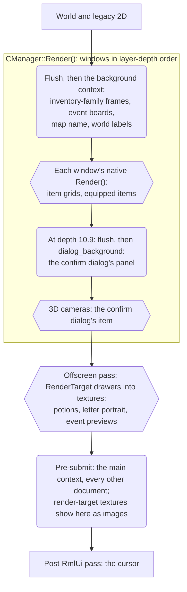

# RmlUi UI System

> **Start with [`architecture-principles.md`](architecture-principles.md)** — the governing
> policy for this migration (layout intent, responsive/scalable/themeable/moddable design). This
> README and every other doc here implement or report status against it; none of them repeat its
> reasoning. Check [`STATUS.md`](STATUS.md) for what's actually done and known gaps.

How [RmlUi](https://github.com/mikke89/RmlUi) (HTML/CSS-driven UI middleware) is integrated into
this client's SDL_GPU renderer, and what's worth knowing before building or porting a window.

## Why this exists

The client's game UI had no layout engine, retained scene graph or data-binding layer. RmlUi is
the long-term replacement, adopted window by window with old and new coexisting rather than a
big-bang rewrite. Every window is now a `mu::ui::window::CObject` (the older `CWin` toolkit is
deleted); see [`migration-ledger.md`](migration-ledger.md) for each window's status.

## Where code goes

- **`Render/RmlUi`**: what RmlUi needs from any host engine. The runtime (lifetime, contexts, the
  frame hook, SDL input, IME), the render and system interfaces, custom decorators. No themes and
  no game state.
- **`UI/RmlBridge`**: what game windows share. Themed loading and theme switching, the model
  helpers, visibility and stacking, the shared tooltip, dragging, text-size policy, and the
  adapters between legacy reference coordinates and RmlUi (root transform, panel readback, the
  keyboard claim). No widget classes and no event or layout system of its own: use RmlUi's.
- **A window**: its model fields, its event callbacks and its game behaviour. Layout, units,
  colours and placement stay in RML/RCSS.

The runtime still reaches into `RmlBridge` and game state today; that and the other integration
seams are in [`tracked-deferrals.md`](tracked-deferrals.md).

## The documents

- **[Building New UI](building-new-ui.md)** — the C++ UI kit's shape and the RmlUi/native
  boundary; base class, folder, widgets, the C++ side of an RmlUi window, and the ownership rules. Read before starting anything under `UI/`.
- **[Component Catalog](component-catalog.md)** — reusable RmlUi/RCSS primitives that exist, and
  what doesn't exist yet. Check before inventing a one-off mechanism.
- **[Layout, Anchoring & Scaling](layout-and-scaling.md)** — the UI-scale (`dp`) mechanism, the
  anchor/stretch/center utility classes, and the scale sweep for hit boxes read from RCSS.
- **[Window Placement](window-placement.md)** — the theme-owned workspace: regions, docks, slots,
  the HUD in the workspace, dragging, and theme recipes.
- **[Theming & Modding](theming-and-modding.md)** — the theme mechanism, adding a theme, and the
  modding constraints.
- **[Engine Findings](engine-findings.md)** — empirical gotchas of this RmlUi build and the
  `CObject`/`CManager` machinery. Check before assuming a bug is new.
- **[Migration Ledger](migration-ledger.md)** — per-class migration status; check here for "is
  `X` done?".
- **[Tracked Deferrals](tracked-deferrals.md)** — what's known-incomplete, and the pilots to
  revisit.

## Renderer integration: SDL_GPU

RmlUi renders through its own vendored SDL_GPU backend
(`src/ThirdParty/RmlUi/Backends/RmlUi_Renderer_SDL_GPU.cpp`) rather than a bridge against
`IMuRenderer`'s game-oriented primitives. `RmlUiRenderInterface`
(`Render/RmlUi/RmlUiRenderInterface.cpp/.h`) subclasses it, overriding only
`LoadTexture`/`ReleaseTexture` so game assets (`.OZT`/`.OZJ`) route through `CGlobalBitmap`.
`transform`, gradients and `box-shadow` render; `filter`/`backdrop-filter`/`mask-image` mostly
don't — `engine-findings.md` has the current list. Test a new visual property in isolation rather
than trusting the parser.

**Texture-lifetime rule**: `CGlobalBitmap`'s numbered slots get force-reassigned across scene
transitions, while RmlUi caches a texture handle indefinitely. Any RmlUi-loaded texture must use
`CGlobalBitmap::LoadImageExclusive()`, never the shared `LoadImage()` — sharing a slot crashes on
scene re-entry.

## Frame lifecycle: render seams

Native drawing and RmlUi share one frame, and each step draws over everything before it.
Hexagons are native 3D, rounded boxes are RmlUi contexts:

A flush draws what has been recorded so far (`FlushRenderCommands()`), so a context rendered right
after it lands over that and under whatever is recorded next. The seams are on `IMuRenderer` and
registered once in `Winmain.cpp`.

- **The main context renders last** (`SetPreSubmitCallback`, `RmlUiRuntime::RenderFrame()`), so an
  opaque panel covers any legacy drawing meant to stay on top. That drawing goes in the post-RmlUi
  pass (`SetPostRmlUiCallback`), which also runs `CSystem::SyncMainSceneHudVisibility()` every
  frame.
- **The background contexts take no input**: every document in them is `pointer-events: none`.
  Only the manager with `SetDrivesBackgroundLayer(true)` (`CSystem`'s) renders them; a window with
  a background document gates that document's visibility on its own `IsVisible()`.
- **Native drawing inside one document** goes into a `UI::RmlBridge::RenderTarget`
  (`SetOffscreenRenderCallback`, `component-catalog.md`), so it sits at its element's depth.
  Moving the background contexts' 3D onto render targets is tracked (`tracked-deferrals.md`), and
  this diagram changes with it.

## Data binding: `RmlModelBinder<T>`

`UI::RmlBridge::RmlModelBinder<Model>` (`UI/RmlBridge/RmlModelBinder.h`) wraps a per-window
`Rml::DataModel`: game state → `SyncRmlModel()` → a plain data struct → bound via
`Rml::DataModelConstructor`. **The model must be created before the document that references it
is loaded** — a model created after `LoadDocument()` is too late and every binding shows its
literal source text. Clicks go through `data-event-click` → `BindEventCallback` (right-click
through `data-event-mouseup`, button 1). A window with no dynamic state can skip the binder and
use `AddEventListener`.

A window holds its binder and documents through `UI::RmlBridge::ThemedView<Model>`
(`UI/RmlBridge/RmlThemedView.h`), which creates the model before loading the documents, rebuilds
both on a theme switch and tears them down; `component-catalog.md` has its options.

## Theming

A theme is a **folder name** — adding one needs no recompile. `UI::RmlBridge::LoadThemedDocument()`
(`UI/RmlBridge/RmlTheme.h/.cpp`) loads a window's `.rml` against a synthetic
`themes/<active-theme>/` URL, so its `<link href>` pulls that theme's `.rcss`; a theme can also
fork the `.rml` itself (`themes/<theme>/<name>.rml`).

**Two themes, `legacy`** (real sprite art, pixel parity with the original) **and `modern`**, are
the intended set — a third was ruled out by the project owner. Change both in the same pass.
Shared rules live in `themes/<name>/base.rcss` (`.btn`, `.checkbox-box`, `.hidden`, the
mandatory `body { pointer-events: none; }` reset). Full mechanism in
[Theming & Modding](theming-and-modding.md).

## Interaction helpers

Any interaction more than one window wants belongs in `UI::RmlBridge` as a shared primitive.
`MakeDraggable(handle, panel, onMove)` (`UI/RmlBridge/RmlDraggable.h/.cpp`) builds on RmlUi's drag
events; the handle needs `pointer-events: auto`, and it moves both axes. Dialogs and the friend
family drag; `CMyInventory` persists its position in `config.ini`. See `component-catalog.md`'s
"Dragging" and `window-placement.md` for the scope.

## Scene windows

The login- and character-scene windows (`g_*Win` globals) are `CObject`s owned by
`CSceneUICoordinator`, which calls each one's `Release()` by name on every scene transition. A
document is created once and reused, and RmlUi renders last, so **each such window's `Release()`
must hide its document** (`CLoginWin::Release()`), or it paints over the next scene.

## Gotchas

- **`pointer-events` trap**: `Context::IsMouseInteracting()` is true over *any* RmlUi hover
  target, so a full-window document with default `pointer-events` swallows every click. Every
  document needs `body { pointer-events: none; }`, opted back in per interactive element
  (`base.rcss` does this for every window that links it).
- **Mouse input is handled directly**, not via RmlUi's `RmlSDL::InputEventHandler`, which calls
  `SDL_CaptureMouse()` on every click and double-scales motion by pixel density. Wheel, key and
  text events use the vendored handler.
- **`.hidden` vs `.disabled`**: `.disabled` keeps an element in layout (dimmed); `.hidden`
  (`display: none`) removes it. Use `.hidden` when something doesn't apply to the current scene at
  all — a dimmed-but-present button once overlapped its neighbour in `CSysMenuWin`.
- **Paint order**: a parent's background paints before its children, and children paint in
  document order. Move the visually topmost element later in the document rather than fighting
  with z-index.

## Source map

| Subsystem | Key files |
|---|---|
| Runtime lifecycle | [`Render/RmlUi/RmlUiRuntime.h/.cpp`](../../src/source/Render/RmlUi/RmlUiRuntime.h) |
| Render interface | [`Render/RmlUi/RmlUiRenderInterface.h/.cpp`](../../src/source/Render/RmlUi/RmlUiRenderInterface.h) |
| System interface | [`Render/RmlUi/RmlUiSystemInterface.h/.cpp`](../../src/source/Render/RmlUi/RmlUiSystemInterface.h) |
| Renderer seams | [`Render/Renderer/MuRenderer.h`](../../src/source/Render/Renderer/MuRenderer.h) |
| Input gating | [`Core/Input/UiInputRouter.cpp`](../../src/source/Core/Input/UiInputRouter.cpp) (`IsMouseOverUI()`) |
| Model/binder layer | [`UI/RmlBridge/RmlModelBinder.h`](../../src/source/UI/RmlBridge/RmlModelBinder.h), [`UI/RmlBridge/RmlThemedView.h`](../../src/source/UI/RmlBridge/RmlThemedView.h) |
| Theme framework | [`UI/RmlBridge/RmlTheme.h/.cpp`](../../src/source/UI/RmlBridge/RmlTheme.h) |
| Draggable helper | [`UI/RmlBridge/RmlDraggable.h/.cpp`](../../src/source/UI/RmlBridge/RmlDraggable.h) |
| Native drawing in a document | [`UI/RmlBridge/RmlRenderTarget.h/.cpp`](../../src/source/UI/RmlBridge/RmlRenderTarget.h) |
| Workspace placement | [`UI/Placement/WindowPlacement.h/.cpp`](../../src/source/UI/Placement/WindowPlacement.h) |
| Texture lifetime | [`Render/Sprites/GlobalBitmap.h/.cpp`](../../src/source/Render/Sprites/GlobalBitmap.h) — `LoadImageExclusive()` |
| RML/RCSS assets | [`bin/Data/Interface/RmlUi/`](../../src/bin/Data/Interface/RmlUi/) — one `.rml` per window + `themes/{legacy,modern}/` |
