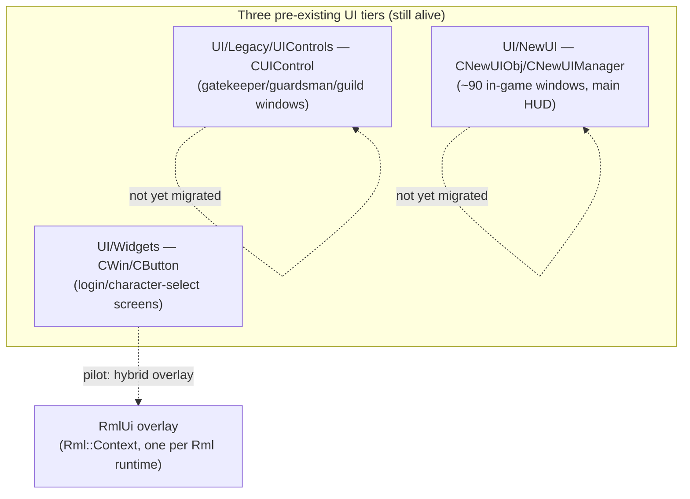
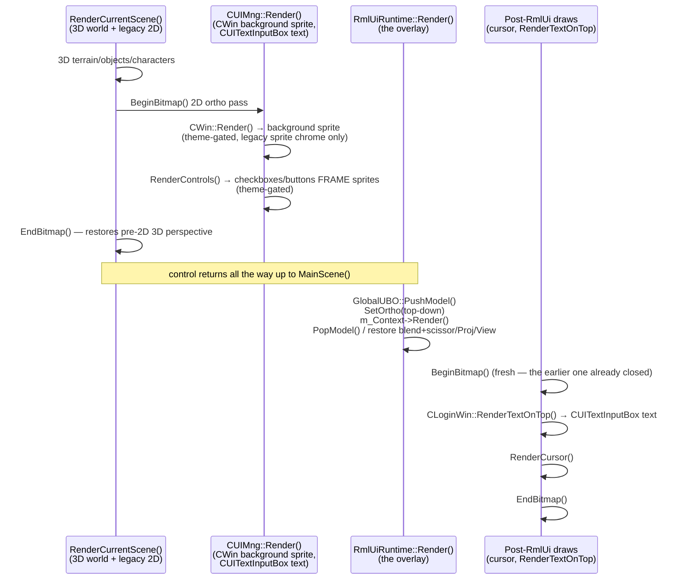

# Architecture

How RmlUi is wired into this engine's renderer, frame loop, and input pipeline. Every claim here
is grounded in the actual pilot implementation (`CLoginWin`) and the vendored RmlUi 6.2 source,
not general RmlUi documentation — where this engine's integration deviates from "how RmlUi
normally works," that's called out explicitly.

## 1. The three-tier coexistence model



No window has been fully retired yet — the login screen is a **hybrid**: `CWin` still owns the
window's position/size/z-order bookkeeping and (theme-dependent) background sprite; RmlUi renders
the interactive overlay (checkboxes, buttons, labels) on top. Retiring a window means removing its
last legacy dependency, not swapping frameworks atomically — see the migration plan's Retirement
criteria for the full checklist.

## 2. Render interface: why a custom one, and what it doesn't do

`RmlUiRenderInterface` (`Render/RmlUi/RmlUiRenderInterface.h/.cpp`) implements `Rml::RenderInterface`
directly against this engine's `RHI::` abstraction — it does **not** use any of RmlUi's bundled
backends. Reasons:

- RmlUi's vertex format (`pos2 + premultiplied-alpha rgba8 + uv2`, 20 bytes) doesn't match this
  engine's only implemented `RHI::VertexLayout` (`PosUvColor`: `pos3+uv2+rgba4`, all floats, 36
  bytes). `CompileGeometry` converts once per compiled-geometry handle (RmlUi's contract is
  compile-once/render-many, not per-frame), rather than adding a 5th vertex layout that would need
  a new shader variant on every backend (including the in-progress D3D11 branch).
- `RenderGeometry` binds the same `PassthroughShader` every other 2D/3D draw call in this engine
  uses, and translates via `GlobalUBO::SetModel(origin, scale)` — a uniform that already existed
  for exactly this purpose. There is no RmlUi-specific shader.

**Only the "required functions for basic rendering" section of `Rml::RenderInterface` is
implemented.** The optional advanced functions — `SetTransform`, layers, filters — are left at
their base-class no-op defaults. This is a deliberate MVP scope cut, but it has a sharp edge: any
RCSS property whose real implementation routes through those optional functions will silently
misrender instead of gracefully degrading. `box-shadow` with a nonzero blur radius is the
concrete example that hit this (see [Gotchas](gotchas-and-patterns.md#box-shadow-blur-renders-as-a-solid-white-block)) —
`Source/Core/GeometryBoxShadow.cpp` calls `RenderManager::PushLayer()`/`CompileFilter("blur")`/
`CompositeLayers()` for any blur ≥ 0.5px, and none of that has anywhere correct to go. CSS
`transform` and `backdrop-filter` are unverified but presumed to have the same problem until
someone actually implements the layer/filter path.

### Premultiplied alpha

RmlUi's own vertex format documents `ColourbPremultiplied` (`Include/RmlUi/Core/Vertex.h`) — genuinely
premultiplied alpha, confirmed against `Colour<>::ToPremultiplied()`'s real formula
(`premult = (straight * alpha) / 255`). Every existing straight-alpha `RHI::BlendMode` (`Blend3` —
`SRC_ALPHA, ONE_MINUS_SRC_ALPHA`) expects **un-premultiplied** colour, so `CompileGeometry`
un-premultiplies once at compile time (dividing RGB by alpha, guarded against `alpha == 0`) rather
than adding a premultiplied-alpha `BlendMode`. This is mathematically exact for a single blend pass
with no layer/filter compositing — revisit only if/when layers or filters are actually
implemented, which genuinely need premultiplied compositing semantics.

### Blend mode: `Blend3`, not `AlphaTest`

`RenderGeometry` uses `RHI::BlendMode::Blend3`, not the seemingly-obvious `AlphaTest`.
`AlphaTest` enables the shader's alpha-test discard threshold (`g_AlphaRef`) as a side effect —
built for hard-cutout foliage sprites, it would silently clip RmlUi's anti-aliased text/element
edges (low-but-nonzero alpha) instead of blending them. `Blend3` is the same
`SRC_ALPHA/ONE_MINUS_SRC_ALPHA` blend func with alpha-test explicitly disabled.

## 3. Frame lifecycle — the render-order contract

This is the single most consequential architectural fact in this whole system, and the source of
two separate real bugs (see [Gotchas](gotchas-and-patterns.md)):

> **RmlUi always renders LAST in the frame**, after all legacy 2D/3D content for that scene has
> already been drawn.



Why this matters concretely: the login screen's **legacy** theme has a fully transparent RmlUi
`#panel` background, so whatever legacy content rendered underneath it (input text, cursor) stayed
visible regardless of draw order — the ordering bug was invisible for the entire time only the
legacy theme existed. The **modern** theme gives `#panel` an opaque `background-color`, which
immediately covered the cursor and input text the first time it was tested. Both symptoms were the
*same* underlying ordering fact, just newly exposed by an opaque panel.

**Practical rule for any future migrated window**: if a window's RmlUi overlay might ever have an
opaque background over a region where legacy content (text, a cursor, anything not itself RmlUi)
needs to stay visible, that legacy content's render call must be moved to run *after*
`RmlUiRuntime::Render()`, in its own `BeginBitmap()/EndBitmap()` bracket — the bracket that was
active during the window's own earlier render pass will already be closed by the time control
returns this far up the call stack (`EndBitmap()` restores `GlobalUBO`'s Proj/View to the 3D
perspective active before `BeginBitmap()` was called, so 2D `ConvertX`/`ConvertY`-based rendering
needs a fresh bracket, not the old one).

### `GlobalUBO` save/restore — three state pieces, not two

`RmlUiRuntime::Render()` brackets its own `m_Context->Render()` call with save/restore for **three**
pieces of `GlobalUBO` state: Proj, View, *and* Model. The first version of this code only
saved/restored Proj/View — `RmlUiRenderInterface::RenderGeometry` calls
`GlobalUBO::SetModel(origin, scale)` once per compiled-geometry draw (translation), and without a
matching restore, whatever the frame's *last* RmlUi draw set Model to (e.g. the login panel's OK
button origin) leaked into every legacy 2D/3D draw issued afterward — visibly shifting legacy UI
elements and the clickable area toward whatever direction that leftover translation pointed.
`GlobalUBO::PushModel()`/`PopModel()` (a stack-based save/restore that already existed for exactly
this shape) now brackets the whole render pass alongside the Proj/View save/restore. See
[Gotchas](gotchas-and-patterns.md#globalubo-model-matrix-leak) for the full incident.

## 4. Input arbitration

Built at the SDL-event level (`Winmain.cpp`'s event switch), not as a per-object polling shim
inside `CNewUIManager`'s frame walk. Each mouse-button/wheel/text/key event is offered to RmlUi
first via `RmlUiRuntime::ProcessSdlEvent()`; if RmlUi consumed it, the corresponding legacy call
(`HandleMouseButton`, `FeedPortableKey`, etc.) is skipped for that event.

- **Mouse button down/up and mouse motion are handled directly**, not through RmlUi's own vendored
  `RmlSDL::InputEventHandler` — that handler calls `SDL_CaptureMouse()` on every button press/
  release (breaks this engine's own cursor-clip handling) and scales motion coordinates by
  `SDL_GetWindowPixelDensity()` (this engine's `Rml::Context` is already sized in real pixels, so
  that scaling double-applies). Wheel/key/text events still route through the vendored handler —
  its SDL-keycode/modifier mapping is reused as-is.
- `Rml::Context::IsMouseInteracting()` backs a third click-to-move gate in `Input/Selection.cpp`,
  alongside the two legacy tiers' own flags (`MouseOnWindow`, `g_pNewUISystem->CheckMouseUse()`).

### The `pointer-events` trap

`Context::IsMouseInteracting()` returns `true` whenever the current hover target is **any** RmlUi
element other than the document root — not just elements with an actual click listener. A
document's `body` sized `width/height: 100%` (the normal pattern for a full-screen RmlUi document)
therefore makes *every* click anywhere on screen register as "RmlUi handled this," silently
swallowing clicks meant for legacy content sitting underneath or beside it — including clicks that
should transfer focus to a legacy text input. See
[Gotchas](gotchas-and-patterns.md#pointer-events-swallows-every-click-on-screen) for the fix
(`pointer-events: none` on `body`, opted back in per interactive element) — **this is not
optional for any future full-window RmlUi document**, not a one-off fix scoped to the login
screen.

## 5. Data binding: model/binder pattern

Nothing like a data-binding layer existed before RmlUi. `UI::RmlBridge::RmlModelBinder<Model>`
(`UI/RmlBridge/RmlModelBinder.h`) generalizes the one existing precedent for this shape
(`UI/NewUI/HUD/Skills/SkillTooltipModel.h/.cpp`) into a reusable per-window wrapper:

```
Game state → BuildModel() → UI::<Domain>::<Concern>Model (plain data)
                                    │  bound via Rml::DataModelConstructor
                                    ▼
                          Rml::DataModel  →  RML template
```

- `RmlModelBinder::Create(context, modelName, registerFieldsLambda)` creates the
  `Rml::DataModelHandle` and hands the caller a lambda to register each field by name — RmlUi's
  own `DataModelConstructor::Bind()` API requires explicit per-field registration, there is no
  reflection.
- **The data model must be created *before* the document that references it is loaded.** RmlUi
  resolves `data-model="..."` and `{{bindings}}` while *parsing* the RML — a model created after
  `LoadDocument()`/`LoadDocumentFromMemory()` is too late, and every `{{...}}` in the document falls
  back to rendering its own literal source text. See
  [Gotchas](gotchas-and-patterns.md#data-model-created-after-the-document-that-references-it).
- Click/toggle actions are **not** modeled through `Rml::DataModel` (it's one-directional,
  model→view) — each migrated window registers `data-event-click` callbacks via
  `DataModelConstructor::BindEventCallback`, whose bodies call the exact same free
  functions/methods the legacy UI already calls. This is what keeps day-one call sites unchanged.

## 6. Coexistence bridging (`CLoginWin`'s specific pattern)

`CLoginWin` (`UI/Windows/LoginWin.h/.cpp`) is a `CWin`-derived class that owns *both* the legacy
state (position/size, `CButton`s, `CUITextInputBox`) and the RmlUi document/model. The legacy
`CButton`s for OK/Cancel/checkboxes stay registered and positioned identically to their RmlUi
replacements — a harmless redundant detection path — while `RmlClickOk()`/`RmlToggleRememberMe()`/
etc. (invoked from RmlUi's `data-event-click` bindings) set the same underlying state the legacy
buttons would have. `SyncRmlModel()` runs every `RenderControls()` call, diffing legacy state
against the bound model and only dirtying fields that actually changed.
