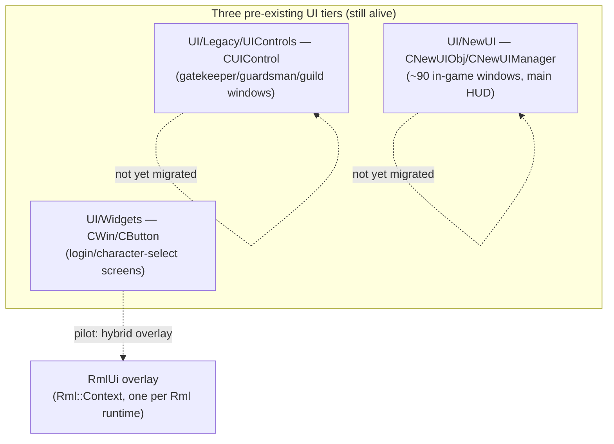

# Architecture

How RmlUi is wired into this engine's renderer, frame loop, and input pipeline. Every claim here
is grounded in the actual pilot implementation (`CLoginWin`) and the vendored RmlUi 6.2 source,
not general RmlUi documentation — where this engine's integration deviates from "how RmlUi
normally works," that's called out explicitly.

## 1. The three-tier coexistence model



No window has been fully retired yet — the login screen is a **hybrid**: `CWin` still owns the
window's position/size/z-order bookkeeping (and its `CursorInWin` hit-testing), but draws nothing
visual at all (`CWin::Create()` is always called with `nTexID=-2`). RmlUi renders 100% of the
visible panel — background, input-box frames, checkboxes, buttons, labels — in every theme; a
"legacy-look" theme reproduces the original art by pointing its own RCSS decorators at the same
image files the old `CWin`/`CSprite` objects used to draw (see
[Theming & Modding](theming-and-modding.md)), it just isn't `CWin` doing the drawing anymore.
Retiring a window means removing its remaining legacy dependency (position/hit-testing), not
swapping frameworks atomically — see the migration plan's Retirement criteria for the full
checklist.

## 2. Render interface: why a custom one, and what it doesn't do

`RmlUiRenderInterface` (`Render/RmlUi/RmlUiRenderInterface.h/.cpp`) implements `Rml::RenderInterface`
directly against this engine's `RHI::` abstraction — it does **not** use any of RmlUi's bundled
backends. Reasons:

- RmlUi's vertex format (`pos2 + premultiplied-alpha rgba8 + uv2`, 20 bytes) doesn't match this
  engine's only implemented `RHI::VertexLayout` (`PosUvColor`: `pos3+uv2+rgba4`, all floats, 36
  bytes). `CompileGeometry` converts once per compiled-geometry handle (RmlUi's contract is
  compile-once/render-many, not per-frame), rather than adding a 5th vertex layout that would need
  a new shader variant on every backend (including the in-progress D3D11 branch).
- `RenderGeometry` binds the same `PassthroughShader` every other 2D/3D draw call in this engine
  uses, and translates via `GlobalUBO::SetModel(origin, scale)` — a uniform that already existed
  for exactly this purpose. There is no RmlUi-specific shader.

### Two texture "kinds" with two different id spaces

Every `Rml::TextureHandle` this class hands out is backed by one of two kinds, tracked internally
(`TextureRecord::kind`): `Generated` (RmlUi's own rasterized content — font glyph atlases — where
`id` is a real `RHI::TextureHandle`/GL name straight from `RHI::CreateTexture`), and `FileBacked`
(any image loaded through `CGlobalBitmap`, e.g. a themed panel's background) where **`id` is a
`CGlobalBitmap` bitmap-*index*, not a GL name at all** — resolving it to something bindable
requires `Bitmaps.GetTexture(id)->TextureNumber`. `ReleaseTexture` dispatches correctly on `kind`;
`RenderGeometry`'s texture-binding line originally didn't (bound `id` directly as a GL name for
both kinds), which went unnoticed for the whole migration until the first `FileBacked` texture was
actually rendered (see [Gotchas](gotchas-and-patterns.md#filebacked-textures-rendered-using-the-wrong-gl-texture-object)
for the full incident) — now fixed, but worth knowing as an invariant if this class grows a third
texture source: **the two id spaces are never interchangeable, and every method that consumes
`TextureRecord::id` needs to dispatch on `kind`, not just some of them.**

**Only the "required functions for basic rendering" section of `Rml::RenderInterface` is
implemented.** The optional advanced functions — `SetTransform`, layers, filters — are left at
their base-class no-op defaults. This is a deliberate MVP scope cut, but it has a sharp edge: any
RCSS property whose real implementation routes through those optional functions will silently
misrender instead of gracefully degrading. `box-shadow` with a nonzero blur radius is the
concrete example that hit this (see [Gotchas](gotchas-and-patterns.md#box-shadow-blur-renders-as-a-solid-white-block)) —
`Source/Core/GeometryBoxShadow.cpp` calls `RenderManager::PushLayer()`/`CompileFilter("blur")`/
`CompositeLayers()` for any blur ≥ 0.5px, and none of that has anywhere correct to go. CSS
`transform` and `backdrop-filter` are unverified but presumed to have the same problem until
someone actually implements the layer/filter path.

### Premultiplied alpha

RmlUi's own vertex format documents `ColourbPremultiplied` (`Include/RmlUi/Core/Vertex.h`) — genuinely
premultiplied alpha, confirmed against `Colour<>::ToPremultiplied()`'s real formula
(`premult = (straight * alpha) / 255`). Every existing straight-alpha `RHI::BlendMode` (`Blend3` —
`SRC_ALPHA, ONE_MINUS_SRC_ALPHA`) expects **un-premultiplied** colour, so `CompileGeometry`
un-premultiplies once at compile time (dividing RGB by alpha, guarded against `alpha == 0`) rather
than adding a premultiplied-alpha `BlendMode`. This is mathematically exact for a single blend pass
with no layer/filter compositing — revisit only if/when layers or filters are actually
implemented, which genuinely need premultiplied compositing semantics.

### Blend mode: `Blend3`, not `AlphaTest`

`RenderGeometry` uses `RHI::BlendMode::Blend3`, not the seemingly-obvious `AlphaTest`.
`AlphaTest` enables the shader's alpha-test discard threshold (`g_AlphaRef`) as a side effect —
built for hard-cutout foliage sprites, it would silently clip RmlUi's anti-aliased text/element
edges (low-but-nonzero alpha) instead of blending them. `Blend3` is the same
`SRC_ALPHA/ONE_MINUS_SRC_ALPHA` blend func with alpha-test explicitly disabled.

## 3. Frame lifecycle — the render-order contract

This is the single most consequential architectural fact in this whole system, and the source of
two separate real bugs (see [Gotchas](gotchas-and-patterns.md)):

> **RmlUi always renders LAST in the frame**, after all legacy 2D/3D content for that scene has
> already been drawn.

```mermaid
sequenceDiagram
    participant Scene as RenderCurrentScene()<br>(3D world + legacy 2D)
    participant UIMng as CUIMng::Render()<br>(CWin draws nothing;<br>CUITextInputBox text stays for later)
    participant Rml as RmlUiRuntime::Render()<br>(the whole panel: bg, frames, controls)
    participant Post as Post-RmlUi draws<br>(cursor, RenderTextOnTop)

    Scene->>Scene: 3D terrain/objects/characters
    Scene->>UIMng: BeginBitmap() 2D ortho pass
    UIMng->>UIMng: CWin::Render() → m_psprBg is null, draws nothing
    UIMng->>UIMng: RenderControls() → SyncRmlModel() only, no legacy drawing left
    Scene->>Scene: EndBitmap() — restores pre-2D 3D perspective
    Note over Scene,Rml: control returns all the way up to MainScene()
    Rml->>Rml: GlobalUBO::PushModel()<br>SetOrtho(top-down)<br>m_Context->Render()<br>PopModel() / restore blend+scissor/Proj/View
    Post->>Post: BeginBitmap() (fresh — the earlier one already closed)
    Post->>Post: CLoginWin::RenderTextOnTop() → CUITextInputBox text
    Post->>Post: RenderCursor()
    Post->>Post: EndBitmap()
```

Why this matters concretely: at the time this ordering bug was found, the login screen's
**legacy** theme had a fully transparent RmlUi `#panel` background, so whatever legacy content
rendered underneath it (input text, cursor) stayed visible regardless of draw order — the bug was
invisible for the entire time only that transparent panel existed. The **modern** theme gave
`#panel` an opaque `background-color`, which immediately covered the cursor and input text the
first time it was tested. Both symptoms were the *same* underlying ordering fact, just newly
exposed by an opaque panel — which is exactly why the `legacy` theme's panel (now also opaque,
since it draws the original background image via `decorator: image(...)` instead of relying on a
transparent RmlUi panel over a CWin-drawn sprite) still renders correctly today: `RenderTextOnTop()`
already runs after `RmlUiRuntime::Render()`, so the input text is never covered regardless of which
theme's panel is opaque.

**Practical rule for any future migrated window**: if a window's RmlUi overlay might ever have an
opaque background over a region where legacy content (text, a cursor, anything not itself RmlUi)
needs to stay visible, that legacy content's render call must be moved to run *after*
`RmlUiRuntime::Render()`, in its own `BeginBitmap()/EndBitmap()` bracket — the bracket that was
active during the window's own earlier render pass will already be closed by the time control
returns this far up the call stack (`EndBitmap()` restores `GlobalUBO`'s Proj/View to the 3D
perspective active before `BeginBitmap()` was called, so 2D `ConvertX`/`ConvertY`-based rendering
needs a fresh bracket, not the old one).

### `GlobalUBO` save/restore — three state pieces, not two

`RmlUiRuntime::Render()` brackets its own `m_Context->Render()` call with save/restore for **three**
pieces of `GlobalUBO` state: Proj, View, *and* Model. The first version of this code only
saved/restored Proj/View — `RmlUiRenderInterface::RenderGeometry` calls
`GlobalUBO::SetModel(origin, scale)` once per compiled-geometry draw (translation), and without a
matching restore, whatever the frame's *last* RmlUi draw set Model to (e.g. the login panel's OK
button origin) leaked into every legacy 2D/3D draw issued afterward — visibly shifting legacy UI
elements and the clickable area toward whatever direction that leftover translation pointed.
`GlobalUBO::PushModel()`/`PopModel()` (a stack-based save/restore that already existed for exactly
this shape) now brackets the whole render pass alongside the Proj/View save/restore. See
[Gotchas](gotchas-and-patterns.md#globalubo-model-matrix-leak) for the full incident.

## 4. Input arbitration

Built at the SDL-event level (`Winmain.cpp`'s event switch), not as a per-object polling shim
inside `CNewUIManager`'s frame walk. Each mouse-button/wheel/text/key event is offered to RmlUi
first via `RmlUiRuntime::ProcessSdlEvent()`; if RmlUi consumed it, the corresponding legacy call
(`HandleMouseButton`, `FeedPortableKey`, etc.) is skipped for that event.

- **Mouse button down/up and mouse motion are handled directly**, not through RmlUi's own vendored
  `RmlSDL::InputEventHandler` — that handler calls `SDL_CaptureMouse()` on every button press/
  release (breaks this engine's own cursor-clip handling) and scales motion coordinates by
  `SDL_GetWindowPixelDensity()` (this engine's `Rml::Context` is already sized in real pixels, so
  that scaling double-applies). Wheel/key/text events still route through the vendored handler —
  its SDL-keycode/modifier mapping is reused as-is.
- `Rml::Context::IsMouseInteracting()` backs a third click-to-move gate in `Input/Selection.cpp`,
  alongside the two legacy tiers' own flags (`MouseOnWindow`, `g_pNewUISystem->CheckMouseUse()`).

### The `pointer-events` trap

`Context::IsMouseInteracting()` returns `true` whenever the current hover target is **any** RmlUi
element other than the document root — not just elements with an actual click listener. A
document's `body` sized `width/height: 100%` (the normal pattern for a full-screen RmlUi document)
therefore makes *every* click anywhere on screen register as "RmlUi handled this," silently
swallowing clicks meant for legacy content sitting underneath or beside it — including clicks that
should transfer focus to a legacy text input. See
[Gotchas](gotchas-and-patterns.md#pointer-events-swallows-every-click-on-screen) for the fix
(`pointer-events: none` on `body`, opted back in per interactive element) — **this is not
optional for any future full-window RmlUi document**, not a one-off fix scoped to the login
screen.

## 5. Data binding: model/binder pattern

Nothing like a data-binding layer existed before RmlUi. `UI::RmlBridge::RmlModelBinder<Model>`
(`UI/RmlBridge/RmlModelBinder.h`) generalizes the one existing precedent for this shape
(`UI/NewUI/HUD/Skills/SkillTooltipModel.h/.cpp`) into a reusable per-window wrapper:

```
Game state → BuildModel() → UI::<Domain>::<Concern>Model (plain data)
                                    │  bound via Rml::DataModelConstructor
                                    ▼
                          Rml::DataModel  →  RML template
```

- `RmlModelBinder::Create(context, modelName, registerFieldsLambda)` creates the
  `Rml::DataModelHandle` and hands the caller a lambda to register each field by name — RmlUi's
  own `DataModelConstructor::Bind()` API requires explicit per-field registration, there is no
  reflection.
- **The data model must be created *before* the document that references it is loaded.** RmlUi
  resolves `data-model="..."` and `{{bindings}}` while *parsing* the RML — a model created after
  `LoadDocument()`/`LoadDocumentFromMemory()` is too late, and every `{{...}}` in the document falls
  back to rendering its own literal source text. See
  [Gotchas](gotchas-and-patterns.md#data-model-created-after-the-document-that-references-it).
- Click/toggle actions are **not** modeled through `Rml::DataModel` (it's one-directional,
  model→view) — each migrated window registers `data-event-click` callbacks via
  `DataModelConstructor::BindEventCallback`, whose bodies call the exact same free
  functions/methods the legacy UI already calls. This is what keeps day-one call sites unchanged.

## 6. Coexistence bridging (`CLoginWin`'s specific pattern)

`CLoginWin` (`UI/Windows/LoginWin.h/.cpp`) is a `CWin`-derived class that owns *both* the legacy
state (position/size, `CButton`s, `CUITextInputBox`) and the RmlUi document/model. The legacy
`CButton`s for OK/Cancel/checkboxes stay registered and positioned identically to their RmlUi
replacements — a harmless redundant detection path — while `RmlClickOk()`/`RmlToggleRememberMe()`/
etc. (invoked from RmlUi's `data-event-click` bindings) set the same underlying state the legacy
buttons would have. `SyncRmlModel()` runs every `RenderControls()` call, diffing legacy state
against the bound model and only dirtying fields that actually changed.

`CSysMenuWin` and `COptionWin` follow the identical shape, with one addition: both previously
relied on `CWin::Create()`'s *default* `nTexID=-1` (a real full-screen alpha=128 black
`m_psprBg`) rather than `CLoginWin`'s `-2`, so migrating them also meant reproducing that dim
backdrop in RmlUi (`#backdrop`, see [Theming & Modding](theming-and-modding.md#backdrop-usage))
and switching their own `CWin::Create()` call to `-2`. Their `CWinEx m_winBack` member stays alive
purely for its quantized-height geometry math (`SetLine()`/`GetWidth()`/`GetHeight()`) — never
rendered, the same "legacy object survives only as bookkeeping" shape `CLoginWin`'s own
`CButton`s already established.

`CLoginMainWin` is the one variant on this pattern worth calling out: it has no dynamic state or
I18N text at all (two pure image buttons), so it skips `RmlModelBinder`/`SyncRmlModel()` entirely
and wires clicks via a plain `Rml::Element::AddEventListener` + a small self-owning listener class
(the same shape `RmlDraggable.cpp`'s own listener uses internally — see §7). The model/binder
layer is the right tool for a window with state to keep in sync, not a mandatory part of the
pattern.

## 6a. A pure-RmlUi window with no `CWin` at all

`RememberPasswordPrompt` (`UI/Windows/RememberPasswordPrompt.h/.cpp`) is a different shape from
every window above: it was never a `CWin`/`CUIMng` window to begin with (previously built on the
shared `SEASON3B::CNewUICommonMessageBox`/`g_MessageBox` engine — a stack shared with ~80
unrelated dialogs elsewhere in the codebase), so migrating it meant no legacy position/hit-testing
state to bridge at all. It's a handful of free functions in `namespace UI::Login` plus file-static
state (a lazily-created `Rml::ElementDocument*` + `RmlModelBinder`, following the same
`if (!doc && RmlUiRuntime::Instance().IsCreated())` creation guard every other window uses, just
without an owning class's `Create()` to hang it on). Its public API
(`OpenRememberPasswordPrompt()`/`RememberPasswordChoiceState()`/`ClearRememberPasswordChoice()`)
stayed byte-identical across the migration — every external call site (all four, in `LoginWin.cpp`)
needed zero changes.

Two things this shape has to solve that a hybrid window doesn't:
- **No `CWin::SetPosition()` to piggyback on for centering.** The panel is centered once, in C++,
  at document-creation time, reading `#panel`'s own RCSS-declared `width`/`height` back via
  `Rml::Element::GetProperty()` and `CInput::Instance().GetScreenWidth()/GetScreenHeight()`. There
  is currently no resize hook — a live resolution change while the dialog is open leaves it
  off-center until the next open. A known, accepted gap, not a hidden one.
- **No natural per-frame tick call site, and no verified RmlUi `Keydown` routing to an unfocused
  document.** The dialog needs to resolve on Enter/Esc the same way its OK/Cancel buttons do, but
  has no naturally-focused element the way `CLoginWin`'s text inputs give it one. Rather than
  introduce RmlUi document-level `Keydown` listening as a new, unverified pattern, it exposes
  `UI::Login::Tick()` — polls `CInput::Instance().IsKeyDown(VK_RETURN/VK_ESCAPE)` while the dialog
  is `Pending` — called once per frame from `CLoginWin::UpdateWhileShow()` (which already ticks
  while this dialog is open, for the same reason `ApplyRememberPasswordChoice()` does). A future
  window that genuinely needs RmlUi-native keyboard focus routing would be the first real test of
  whether that unverified path works; this one deliberately didn't become that test.

## 7. Reusable interaction helpers (`UI::RmlBridge`)

**Standing design principle**: any interaction pattern more than one migrated window will
plausibly want belongs in `UI::RmlBridge` as a shared, generic primitive — not hand-rolled per
window. `RmlModelBinder` (data binding) and `RmlTheme` (theming) already follow this; draggability
is the newest example, added specifically because re-implementing `CWin::Update()`'s `WS_MOVE`
state machine (title-bar hit-rect, mouse-delta tracking, `SetPosition()` calls) for every future
panel that wants to move would be exactly the duplicated logic `docs/CODING_RULES.md` warns
against.

### `UI::RmlBridge::MakeDraggable` (`UI/RmlBridge/RmlDraggable.h/.cpp`)

Built on RmlUi's own native drag events (`Style::Drag::Drag`, `EventId::Dragstart`/`Drag` —
`Source/Core/Context.cpp`'s `UpdateHoverChain`, which already carries the current mouse position
as event parameters) rather than hand-rolled `mousedown`/`mousemove`/`mouseup` tracking.
`MakeDraggable(handle, panel, onMove = nullptr)`:

- Sets `drag: drag` **and** `pointer-events: auto` on `handle` itself, so the caller doesn't need
  matching RCSS for either. The second one is not optional decoration — a handle that inherited
  `pointer-events: none` (the normal state for anything under a full-window document following the
  pointer-events fix, [Gotchas](gotchas-and-patterns.md#pointer-events-swallows-every-click-on-screen))
  never becomes `hover` at all, so `dragstart`/`drag` never fire regardless of the `drag` property
  — confirmed the hard way during a real test (zero events reached the listener, not even
  `mouseover`, until `pointer-events: auto` was forced).
- Repositions `panel` by setting its `left`/`top` properties directly from each `drag` event's
  `mouse_x`/`mouse_y` parameters, relative to the position captured at `dragstart`.
- **`handle` should be a dedicated grab area, not the whole panel** — for any window whose panel
  inherited `pointer-events: none` for the click-passthrough fix (true of every full-window
  document so far), the panel itself can't be dragged directly without reintroducing that exact
  bug for whatever's underneath it. This isn't a workaround; it's the same reason real UI
  toolkits use a title bar instead of "drag from anywhere on the window body" — content inside a
  panel (buttons, text fields) needs to keep receiving its own clicks.
- **The optional `onMove` callback exists because RmlUi and any remaining legacy state are NOT
  actually linked beyond a one-time position sync.** At the time this was built and tested, the
  login window still had a `CWin`-drawn background sprite alongside the RmlUi overlay — two
  independently-rendered things that merely started at the same position (both set once from the
  same `CWin::SetPosition()` call). RmlUi has no knowledge of `CWin::m_ptPos`, and moving one never
  moves the other. Confirmed by a real test: dragging via `MakeDraggable()` alone moved the RmlUi
  checkboxes/buttons/labels correctly, while the legacy background sprite underneath them stayed
  exactly where it started, immediately and visibly desyncing. `onMove(newLeft, newTop)` fires on
  every drag tick specifically so a caller can update whatever legacy state still needs to track
  the panel (a `CWin::SetPosition()` call, hit-test bookkeeping, etc.) in lockstep. The login
  window no longer has a `CWin`-drawn sprite to desync from (see §1 — `CWin` draws nothing for it
  in any theme now), but `CWin` still owns this window's position/hit-testing, so the same
  reasoning would still apply the moment position itself needs to move with the panel; a fully
  migrated window with no remaining legacy state at all has nothing to sync and can omit the
  callback entirely.

First proven against a real build+run using the login screen's document as a throwaway test bed (a
temporary handle wired to `.trust-warning`, since `#panel` itself can't be its own handle for the
reason above) — not wired up as a real feature there, since the login screen is meant to stay
static. Its first real production use is `COptionWin`'s two sliders (Batch 2): each slider's thumb
is its own `handle` *and* `panel` (there's nothing else to move), with the `onMove` callback
clamping to the track's real travel distance and snapping to the slider's discrete step count —
the same discrete-position math `CSlider::Update()` does for the legacy widget, just applied to a
hand-rolled RmlUi element instead. This surfaced a real gotcha `MakeDraggable` itself doesn't
solve: it tracks **both** axes (sets `left` *and* `top` from the drag delta), which is correct for
a freely-draggable panel but wrong for a horizontal-only slider track — the caller has to reset
`top` back to a fixed value on every drag tick, or the thumb visibly drifts vertically with the
cursor. See
[Gotchas](gotchas-and-patterns.md#makedraggable-tracks-both-axes-a-horizontal-only-slider-has-to-fight-that)
for the full writeup. `CSlider`'s legacy widget stays alive alongside the RmlUi thumb purely for
input-detection redundancy (mirrored via `SetSlidePos()` after every drag), the same pattern every
other migrated control in this codebase follows.
