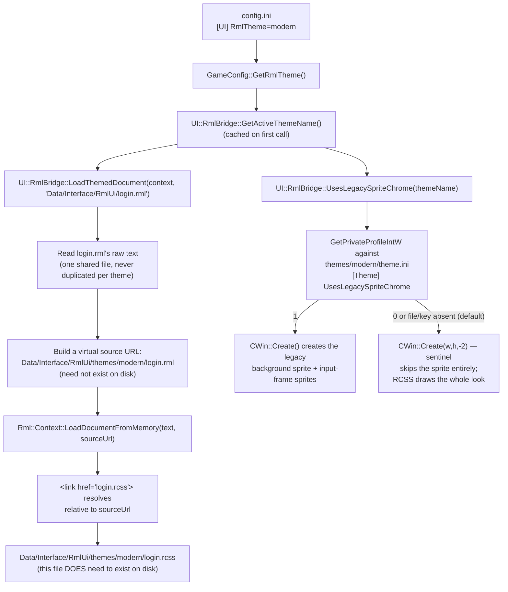

# Theming & Modding

How the swappable-theme system works, and how to add a new theme — including a modder-supplied
one — without touching engine source code.

## Design goal

The owner's requirement (referencing Dota 2's Panorama UI as the model): start with the current
legacy sprite/texture look, but be able to swap in modernized themes later, and — once actually
tried — support **multiple real themes side by side** to prototype the switching mechanism itself,
not just ship one theme. The framework below is the result: a theme is identified by **folder
name**, not a closed C++ enum, specifically so that adding a theme (including a fully
programmatic, sprite-free one) is normally a zero-source-change, drop-a-folder operation.

## Core principle: RML is theme-agnostic, RCSS is the swappable unit

RML files describe structure/content/data-bindings only — what elements exist, what they're bound
to. They never hardcode a visual look inline. All actual appearance (colors, borders, backgrounds,
button/checkbox art) belongs in RCSS, so **a new theme is a new RCSS file (or folder of them)
reusing the same class names, not a new RML file.**

## How theme resolution actually works



The key mechanism, `UI::RmlBridge::LoadThemedDocument()` (`UI/RmlBridge/RmlTheme.h/.cpp`), is what
keeps RML shared and un-duplicated: it reads the RML file's text once, then calls
`Rml::Context::LoadDocumentFromMemory(text, perThemeVirtualSourceUrl)`. RmlUi resolves a
document's relative asset/`<link>` paths against whatever `source_url` was passed to
`LoadDocumentFromMemory` (confirmed against RmlUi 6.2 source — `Context::LoadDocumentFromMemory`
wraps the string in a `StreamMemory` and calls `SetSourceURL()` on it before parsing;
`XMLNodeHandlerHead.cpp`'s `MakeExternalResource()` resolves `<link href>` via
`Absolutepath(path, parser->GetSourceURL())`). The virtual source URL itself
(`Data/Interface/RmlUi/themes/<name>/login.rml`) never needs to exist as a real file — only the
`.rcss` it resolves to does.

## `theme.ini` manifest

Optional. Lives at `Data/Interface/RmlUi/themes/<name>/theme.ini`:

```ini
[Theme]
UsesLegacySpriteChrome=1
```

Read directly via `GetPrivateProfileIntW` against that theme's own file — **not** a hardcoded C++
allowlist. Absence of the file, or absence of the key inside it, both default to `0`
(fully programmatic). This is deliberately data-driven per theme folder: a theme that wants to
reuse legacy sprite chrome (the `legacy` theme's shape) ships one line in its own `theme.ini`; a
theme that doesn't (the common case — a reskin, seasonal theme, accessibility theme, or a mod)
needs no manifest at all.

## Adding a new theme — step by step

**The common case: a fully programmatic (sprite-free) theme.** No source changes, no
recompilation.

1. Create `src/bin/Data/Interface/RmlUi/themes/<your-theme-name>/`.
2. Write `login.rcss` in that folder, styling the same class names the shared `login.rml` uses
   (`#panel`, `.label`, `.checkbox-row`, `.checkbox-box`, `.btn`, `.trust-warning`,
   `.input-frame` — see `themes/modern/login.rcss` for a complete real example, and
   [Architecture](architecture.md) §2 for which RCSS properties are safe to use — **avoid
   `box-shadow` with a blur radius**, it isn't supported (see
   [Gotchas](gotchas-and-patterns.md#box-shadow-blur-renders-as-a-solid-white-block)).
3. (Optional) Add a `theme.ini` if you want `UsesLegacySpriteChrome=1` — most new themes won't.
4. Edit `config.ini`'s `[UI]` section: `RmlTheme=<your-theme-name>`.
5. Relaunch. No rebuild needed — this is a pure data/config change.

**The rarer case: a theme that reuses legacy sprite chrome.** Same as above, plus set
`UsesLegacySpriteChrome=1` in that theme's `theme.ini`. Note this only affects the *background*
sprite and the input-box *frame* sprites for windows built the way `CLoginWin` is (a `CWin`
subclass whose `Create()` checks `UsesLegacySpriteChrome` before creating those specific sprites)
— a future migrated window that never had legacy sprite chrome to begin with has nothing to gate.

## A third case: a theme with its own custom images

`UsesLegacySpriteChrome` only controls whether the *old, hardcoded, non-authorable* legacy
bitmaps (`BITMAP_LOG_IN+7`, `BITMAP_CHECK_BTN`, `BITMAP_BUTTON` — literal C++ constants a modder
cannot add to without a source change) get drawn underneath the RmlUi overlay. It has nothing to
do with whether a theme can have **its own new image assets** — a custom background photo, custom
button art, a logo. That's a separate, already-working capability: RmlUi's own `LoadTexture`
(`RmlUiRenderInterface.cpp`) already routes any image an RCSS file references through this
engine's normal texture pipeline. No engine changes are needed to use it — but there are two real
constraints worth knowing before you do, and they're rougher than the sprite-free case above.

**How the image reference resolves.** Confirmed against RmlUi's real source
(`Source/Core/StyleSheetParser.cpp`, `ElementEffects.cpp`, `Decorator.cpp`): a relative image path
inside an RCSS rule resolves against **that stylesheet's own location** — not the shared `login.rml`'s
virtual per-theme URL. So a custom theme's background image can simply sit next to its own
`login.rcss`:

```
themes/<your-theme-name>/
    login.rcss
    panel_bg.tga      <- referenced from login.rcss below
```

```rcss
#panel {
    decorator: image( panel_bg.tga );
}
```

**The real constraint: only this engine's proprietary OZT/OZJ containers are supported, not plain
PNG/JPG/BMP.** `RmlUiRenderInterface::LoadTexture` routes through `CGlobalBitmap::LoadImage`
(`Render/Sprites/GlobalBitmap.cpp`) — the same loader every other texture in the game uses, so
RmlUi-referenced images share its ref-counted cache/eviction. That loader only handles two
extensions: `.jpg` (via `OpenJpegTurbo`) and `.tga` (via `OpenTga`) — and **both internally swap
the extension to this engine's own container format before opening** (`.OZJ`/`.OZT`
respectively). Concretely: if your RCSS references `panel_bg.tga`, the file that actually needs to
exist on disk is `panel_bg.OZT`, not a real `.tga`. Any other extension (`.png`, `.bmp`, ...) isn't
handled at all. There is no PNG/JPG→OZT/OZJ converter in this repository — a modder needs an
external tool from the wider MU private-server modding community (this format predates this
project) to produce one.

**Failures are completely silent.** A missing file or an unsupported extension returns `false`
from `LoadImage` with **no log line at all** — `RmlUiRenderInterface::LoadTexture` then returns a
null texture handle, and the element just renders with no image, no error, no diagnostic. If a
custom theme's image isn't showing up, double-check the extension-swap rule above (a real `.tga`
file, or a file with the wrong internal container, both fail exactly the same silent way) before
assuming something else is wrong.

**Open follow-up, not yet decided or built**: vendoring `stb_image.h` (a small, permissively-licensed
single-header decoder — not currently vendored anywhere in this repo, confirmed by search) to give
`RmlUiRenderInterface::LoadTexture` a fallback path for plain PNG/JPG/BMP/TGA when the OZT/OZJ
lookup fails, specifically for RmlUi-referenced theme assets. This would make custom-sprite
theming meaningfully easier for modders (no proprietary-format conversion step) without touching
the legacy game-asset pipeline everything else still uses. Flagged as a real option, not started.

## Known limitations (as of the Phase 1 pilot)

- **Not yet a live in-game hot-swap.** Switching themes today means editing `config.ini` and
  relaunching. A true runtime toggle needs each migrated window to tear down and rebuild its
  `Rml::ElementDocument`/`DataModel` against the new theme (and, for sprite-backed themes, its
  `CWin` background/frame sprites) — the teardown/rebuild lifecycle (`Context::RemoveDataModel`
  semantics, `CSprite` re-`Create()` safety) hasn't been verified safe enough to build yet. Real
  follow-up work, not started.
- **`box-shadow` with a blur radius is unsupported** — see
  [Gotchas](gotchas-and-patterns.md#box-shadow-blur-renders-as-a-solid-white-block). Stick to
  `background-color`, `border`, and `border-radius` for a themed panel's look; all three are pure
  geometry and render correctly.
- **Custom theme images require this engine's proprietary OZT/OZJ format, not plain PNG/JPG** —
  see [A third case: a theme with its own custom images](#a-third-case-a-theme-with-its-own-custom-images)
  above. No converter tool exists in this repo today, and a missing/wrong-format image fails
  completely silently.
- **Only the login screen has a theme system today.** Every other window (still-legacy or a
  future RmlUi migration) doesn't participate in theme selection yet — extending
  `LoadThemedDocument()` to a new window is the same pattern `CLoginWin` already uses, not new
  design work.
