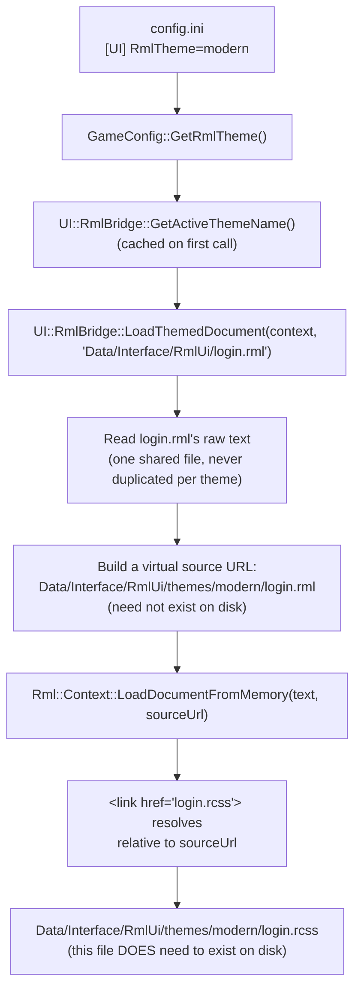

# Theming & Modding

How the swappable-theme system works, and how to add a new theme — including a modder-supplied
one — without touching engine source code.

## Design goal

The owner's requirement (referencing Dota 2's Panorama UI as the model): start with the current
legacy sprite/texture look, but be able to swap in modernized themes later, and — once actually
tried — support **multiple real themes side by side** to prototype the switching mechanism itself,
not just ship one theme. The framework below is the result: a theme is identified by **folder
name**, not a closed C++ enum, specifically so that adding a theme (including a fully
programmatic, sprite-free one) is normally a zero-source-change, drop-a-folder operation.

## Core principle: RML is theme-agnostic, RCSS is the swappable unit

RML files describe structure/content/data-bindings only — what elements exist, what they're bound
to. They never hardcode a visual look inline. All actual appearance (colors, borders, backgrounds,
button/checkbox art) belongs in RCSS, so **a new theme is a new RCSS file (or folder of them)
reusing the same class names, not a new RML file.**

## How theme resolution actually works



`CWin::Create()` always passes `nTexID=-2` for this window — CWin never draws background/frame
chrome, in any theme. A "legacy-look" theme (like `themes/legacy/login.rcss`) reproduces the
original look with its own `decorator: image(...)` rules pointing at the same art files the old
sprites used; a "modern" theme uses flat colors/vector shapes instead. Either way, RmlUi renders
100% of it — see [Core principle](#core-principle-rml-is-theme-agnostic-rcss-is-the-swappable-unit)
above and the note on an earlier, removed mechanism in
[Gotchas](gotchas-and-patterns.md#a-per-theme-flag-to-opt-back-into-cwin-sprite-rendering-was-the-wrong-shape).

The key mechanism, `UI::RmlBridge::LoadThemedDocument()` (`UI/RmlBridge/RmlTheme.h/.cpp`), is what
keeps RML shared and un-duplicated: it reads the RML file's text once, then calls
`Rml::Context::LoadDocumentFromMemory(text, perThemeVirtualSourceUrl)`. RmlUi resolves a
document's relative asset/`<link>` paths against whatever `source_url` was passed to
`LoadDocumentFromMemory` (confirmed against RmlUi 6.2 source — `Context::LoadDocumentFromMemory`
wraps the string in a `StreamMemory` and calls `SetSourceURL()` on it before parsing;
`XMLNodeHandlerHead.cpp`'s `MakeExternalResource()` resolves `<link href>` via
`Absolutepath(path, parser->GetSourceURL())`). The virtual source URL itself
(`Data/Interface/RmlUi/themes/<name>/login.rml`) never needs to exist as a real file — only the
`.rcss` it resolves to does.

## Adding a new theme — step by step

No source changes, no recompilation — every theme, whether it reuses the original art or brings
its own, is a drop-a-folder operation.

1. Create `src/bin/Data/Interface/RmlUi/themes/<your-theme-name>/`.
2. Write `login.rcss` in that folder, styling the same class names the shared `login.rml` uses
   (`#panel`, `.label`, `.checkbox-row`, `.checkbox-box`, `.btn`, `.trust-warning`,
   `.input-frame` — see `themes/modern/login.rcss` for a flat-color/vector-shape example, and
   `themes/legacy/login.rcss` for an image-decorator example — and
   [Architecture](architecture.md) §2 for which RCSS properties are safe to use — **avoid
   `box-shadow` with a blur radius**, it isn't supported (see
   [Gotchas](gotchas-and-patterns.md#box-shadow-blur-renders-as-a-solid-white-block)).
3. Edit `config.ini`'s `[UI]` section: `RmlTheme=<your-theme-name>`.
4. Relaunch. No rebuild needed — this is a pure data/config change.

## Bringing your own images to a theme

Every migrated window's background/frame chrome is drawn by RmlUi itself, in every theme — never
by `CWin` or any other legacy widget (see [Gotchas](gotchas-and-patterns.md) for why an earlier
per-theme flag that let a theme opt back into `CWin`-drawn chrome was removed). A theme is free to
either reuse the original hardcoded legacy bitmaps (`BITMAP_LOG_IN+7`'s file,
`Interface/login_back.tga`, is exactly what `themes/legacy/login.rcss`'s `#panel` decorator
references — see it for a complete real example) or bring **its own new image assets** — a custom
background photo, custom button art, a logo. Both go through the same, already-working path:
RmlUi's own `LoadTexture` (`RmlUiRenderInterface.cpp`) routes any image an RCSS file references
through this engine's normal texture pipeline. No engine changes are needed to use it — but there
are three real constraints worth knowing before you do.

**How the image reference resolves.** Confirmed against RmlUi's real source
(`Source/Core/StyleSheetParser.cpp`, `ElementEffects.cpp`, `Decorator.cpp`): a relative image path
inside an RCSS rule resolves against **that stylesheet's own location** — not the shared `login.rml`'s
virtual per-theme URL. So a custom theme's background image can simply sit next to its own
`login.rcss`:

```
themes/<your-theme-name>/
    login.rcss
    panel_bg.tga      <- referenced from login.rcss below
```

```rcss
#panel {
    decorator: image( panel_bg.tga );
}
```

This is enough to prove path resolution, but not necessarily enough to render correctly as-is —
read the next two constraints (format, and non-power-of-two sizing) before trusting a direct
path reference like this in a real theme.

**The real constraint: only this engine's proprietary OZT/OZJ containers are supported, not plain
PNG/JPG/BMP.** `RmlUiRenderInterface::LoadTexture` routes through `CGlobalBitmap::LoadImage`
(`Render/Sprites/GlobalBitmap.cpp`) — the same loader every other texture in the game uses, so
RmlUi-referenced images share its ref-counted cache/eviction. That loader only handles two
extensions: `.jpg` (via `OpenJpegTurbo`) and `.tga` (via `OpenTga`) — and **both internally swap
the extension to this engine's own container format before opening** (`.OZJ`/`.OZT`
respectively). Concretely: if your RCSS references `panel_bg.tga`, the file that actually needs to
exist on disk is `panel_bg.OZT`, not a real `.tga`. Any other extension (`.png`, `.bmp`, ...) isn't
handled at all. There is no PNG/JPG→OZT/OZJ converter in this repository — a modder needs an
external tool from the wider MU private-server modding community (this format predates this
project) to produce one.

**A non-power-of-two-sized image needs an explicit `@spritesheet` declaration, or it will render
squished with visible padding.** This engine's `.OZT`/`.OZJ` loaders pad every texture up to the
next power-of-two size internally (a 329×245 image becomes a 512×256 texture, real content in the
top-left corner, the rest zero-filled) — invisible to legacy `CSprite` callers (which track their
own real dimensions separately) but **not** invisible to a plain `decorator: image("file.tga")`,
which always samples the *entire* stored texture as 0..1 UV. The fix is to declare the image as a
named sprite with its real pixel rectangle, and reference the sprite name instead of the raw path:

```rcss
@spritesheet panel-bg-sheet
{
    src: panel_bg.tga;
    panel-bg-image: 0px 0px 329px 245px;  /* the image's REAL, unpadded pixel size */
}

#panel {
    decorator: image(panel-bg-image);   /* the sprite name, not "panel_bg.tga" directly */
}
```

If the image's real dimensions genuinely are an exact power of two (256×256, 512×128, ...), this
step is unnecessary — the padding is a no-op and a direct path reference renders correctly. See
[Gotchas](gotchas-and-patterns.md#a-referenced-images-real-unpadded-size-must-be-declared-via-spritesheet-not-assumed)
for the full root-cause writeup.

**Failures are completely silent.** A missing file or an unsupported extension returns `false`
from `LoadImage` with **no log line at all** — `RmlUiRenderInterface::LoadTexture` then returns a
null texture handle, and the element just renders with no image, no error, no diagnostic. If a
custom theme's image isn't showing up, double-check the extension-swap rule above (a real `.tga`
file, or a file with the wrong internal container, both fail exactly the same silent way) before
assuming something else is wrong.

**Open follow-up, not yet decided or built**: vendoring `stb_image.h` (a small, permissively-licensed
single-header decoder — not currently vendored anywhere in this repo, confirmed by search) to give
`RmlUiRenderInterface::LoadTexture` a fallback path for plain PNG/JPG/BMP/TGA when the OZT/OZJ
lookup fails, specifically for RmlUi-referenced theme assets. This would make custom-sprite
theming meaningfully easier for modders (no proprietary-format conversion step) without touching
the legacy game-asset pipeline everything else still uses. Flagged as a real option, not started.

## Coordinates, scaling, and positioning — what a theme actually controls

A natural question once you're authoring custom sprites: if I supply an image at a fixed pixel
size, will the engine scale it correctly for me across resolutions? And separately, does my
theme's RCSS decide where the whole panel sits on screen, or whether it can be dragged? The
honest answers are more specific than "yes, handled automatically" — worth being precise about,
since they shape what a theme author should and shouldn't expect to control.

### Scaling and aspect ratio: nothing is automatic today

Every coordinate in both existing themes (`legacy` and `modern`) is **fixed pixels**
(`left: 150px`, `width: 54px`, ...), and nothing scales those values based on resolution or
window size. A 1920×1080 window and a 1024×768 window render the login panel at the *exact same
physical pixel size* — the only thing that changes is the panel's on-screen position, and that's
recentered by legacy C++ code (see below), not by any scaling RmlUi does.

RmlUi itself does have real scaling primitives — `%` (relative to the containing block), `vw`/`vh`
(true viewport-percentage units), and `dp` (density-independent pixels, globally rescaled via a
single `Context::SetDensityIndependentPixelRatio()` call — RmlUi's own built-in mechanism for a
modern-game-style "UI Scale" option, confirmed against `Source/Core/ComputeProperty.cpp`/
`Context.cpp`). **None of this is wired up in this engine yet.** Using `dp` instead of `px` in a
theme's RCSS today would have zero visible effect, because nothing ever calls
`SetDensityIndependentPixelRatio()` with anything other than its default. Making a theme actually
scale with resolution needs two things together: the theme author using relative units, *and* an
engine-side driver computing and applying a ratio — only the first half is available today. See
the migration plan's "Scaling & DPI" section for the intended direction (a **uniform** fit factor,
`min(WindowWidth/refWidth, WindowHeight/refHeight)`, never independent per-axis scaling — that
non-uniform scaling is a confirmed, separate legacy bug, not something to reproduce; see
[Gotchas](gotchas-and-patterns.md)).

Practically: fixed `px` is also just the *correct* choice for a raster sprite regardless of
whether scaling is wired up — an image has a native resolution, and stretching it non-uniformly or
upscaling it blurs/pixelates. Real resolution-independence for sprite art means authoring multiple
resolution variants or switching to vector-friendly RCSS (flat colors, `border-radius`), not
scaling one fixed image. A custom-sprite theme should expect to look the same physical size at
every resolution, the same way the `legacy` theme's original artwork always has.

### Panel position vs. element layout vs. draggability — three different owners

These are easy to conflate but are controlled by three different, independent things:

- **Layout of elements *within* the panel** (where a label, button, or checkbox sits relative to
  the panel's own top-left corner) — this is fully expressed in RCSS (`.btn-ok { left: 150px; top:
  200px; }`, etc.) and is exactly what a theme controls. Change these values and the layout
  changes, no C++ involved.
- **The panel's own position on screen** (centered, edge-pinned, or anywhere else) — for the
  current login pilot, this is **not** theme-controlled at all. `CLoginWin::SetPosition()` pushes
  the panel's `left`/`top` values in from C++ every frame/resize, driven by the legacy `CUIMng`
  centering math (`(GetScreenWidth() - panelWidth) / 2`-style) — the exact same math that
  positions the legacy background sprite. A theme's RCSS receives this position; it doesn't choose
  it. This is a consequence of the login screen still being a *hybrid* window (part `CWin`, part
  RmlUi) — a window built without any leftover `CWin` positioning dependency could express its own
  anchoring purely in RCSS (`position: absolute; right: 0; bottom: 0;` for a corner-pinned HUD
  element, for example), but that's not how this pilot is built.
- **Draggability** — purely a legacy `CWin` concept (`CWin::Update()`'s `WS_MOVE` state machine,
  gated by `CursorInWin(WA_MOVE)`), entirely unrelated to RmlUi or RCSS. `CLoginWin` explicitly
  hardcodes this off (`CursorInWin` always returns `false` for `WA_MOVE`) — a deliberate choice for
  a login screen, not a limitation of the framework. RmlUi/RCSS has no built-in "make this
  draggable" concept the way a desktop UI toolkit might; a future window wanting drag behavior
  through RmlUi would need to implement it itself via mouse-event handlers, not a CSS property.

**Bottom line for a modder**: your theme's RCSS fully controls what's *inside* the panel and (for
the login screen specifically) nothing about *where the panel is* or *whether it moves* — those
are inherited from the legacy window this pilot hasn't fully cut ties with yet.

## Known limitations (as of the Phase 1 pilot)

- **Not yet a live in-game hot-swap.** Switching themes today means editing `config.ini` and
  relaunching. A true runtime toggle needs each migrated window to tear down and rebuild its
  `Rml::ElementDocument`/`DataModel` against the new theme — the teardown/rebuild lifecycle
  (`Context::RemoveDataModel` semantics) hasn't been verified safe enough to build yet. Real
  follow-up work, not started.
- **`box-shadow` with a blur radius is unsupported** — see
  [Gotchas](gotchas-and-patterns.md#box-shadow-blur-renders-as-a-solid-white-block). Stick to
  `background-color`, `border`, `border-radius`, and `decorator: image(...)` for a themed panel's
  look; all render correctly.
- **Custom theme images require this engine's proprietary OZT/OZJ format, not plain PNG/JPG** —
  see [Bringing your own images to a theme](#bringing-your-own-images-to-a-theme) above. No
  converter tool exists in this repo today, and a missing/wrong-format image fails completely
  silently.
- **No scaling is wired up, and the panel's on-screen position isn't theme-controlled** — see
  [Coordinates, scaling, and positioning](#coordinates-scaling-and-positioning--what-a-theme-actually-controls)
  above. Themes are fixed-`px` and always render at the same physical size regardless of
  resolution; the login panel's own screen position and draggability are inherited from the
  legacy `CWin` this pilot is still hybrid with, not something a theme's RCSS decides.
- **Only the login screen has a theme system today.** Every other window (still-legacy or a
  future RmlUi migration) doesn't participate in theme selection yet — extending
  `LoadThemedDocument()` to a new window is the same pattern `CLoginWin` already uses, not new
  design work.
